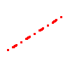
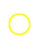
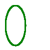
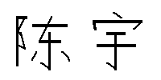

# 计算机图形学第一次实验-图形函数库

## 1. 实验内容

设计和实现一个图形函数库，具有绘制直线段、任意圆弧、椭圆弧、多边形区域的阴影填充和颜色填充等功能（仅调用画点函数）, 要求显示功能效果并能使用所设计库函数显示完成者名字

## 2. 实验环境

* Python 3.11
* Pillow 10.1

## 3. 实验步骤

### 3.1 直线段

使用 Bresenham 算法绘制直线段

```python
# draw line
# start: the start point of the line, tuple as (x, y)
# end: the end point of the line, tuple as (x, y)
# width: line width, integer
# color: line color, string
# type: line type, string, default as 'solid', choices=['solid', 'dotted', 'dashed', 'dashed-dotted']
def line(self, start, end, width=1, color='black', type='solid'):
    # if the coodinates of start and end are not integer or the width is not integer
    if not isinstance(start[0], int) or not isinstance(start[1], int) or not isinstance(end[0], int) or not isinstance(end[1], int) or not isinstance(width, int):
        raise RuntimeError('Invalid coordinates or width, the coodinates and width should be integer')
    
    # using state transferring to draw line type
    states = []
    if type == 'solid':
        states = [True]
    elif type == 'dotted':
        states = [True] + [False] * width * 2
    elif type == 'dashed':
        states = [True] * width * 2 + [False] * width * 2
    elif type == 'dashed-dotted':
        states = [True] + [False] * width * 2 + [True] * width * 2 + [False] * width * 2
    else:
        raise RuntimeError('Invalid line type')
    
    # if the absolute value of slope is bigger than 1
    is_exchange = False
    if abs(end[1] - start[1]) > abs(end[0] - start[0]):
        is_exchange = True
        end = end[1], end[0]
        start = start[1], start[0]

    # if delta_x is less than zero
    if end[0] - start[0] < 0:
        start, end = end, start

    # if delta_y is less than zero
    is_decrease = False
    if end[1] - start[1] < 0:
        is_decrease = True
        
    xs, ys = start
    xe, ye = end
    delta_x = xe - xs
    delta_y = abs(ye - ys)
    e = - delta_x
    x, y = xs, ys 

    state = 0
    for i in range(0, delta_x + 1):
        if states[state]:
            # if the absolute value of slope is bigger than 1, the x and y are exchanged
            if is_exchange:
                for i in range(0, width):
                    for j in range(0, width):
                        self._image.putpixel((y + i, x + j), ImageColor.getrgb(color))
            else:
                for i in range(0, width):
                    for j in range(0, width):
                        self._image.putpixel((x + i, y + j), ImageColor.getrgb(color))

        if e >= 0:
            # if delta_y is less than zero, y should decrease
            if is_decrease:
                y -= 1
            else:
                y += 1
            e -= 2 * delta_x            
        x += 1
        e += 2 * delta_y

        # state transferring
        state = (state + 1) % len(states)
```

### 3.2 任意圆弧

使用 Bresenham 算法绘制任意圆弧

```python
# draw circle
# xy: the center of the circle, tuple as (x, y)
# r: radius, integer
# width: line width, integer
# color: line color, string
def circle(self, xy, r, width=1, color='black'):
    # if the coodinates of xy and radius are not integer or the width is not integer
    if not isinstance(xy[0], int) or not isinstance(xy[1], int) or not isinstance(r, int) or not isinstance(width, int):
        raise RuntimeError('Invalid coordinates or radius or width, the coodinates, radius and width should be integer')
    
    d = 3 - 2 * r
    x, y = 0, r
    while x <= y:
        for i in range(width):
            for j in range(width):
                # using 8-way symmetry
                self._image.putpixel((xy[0] + x + i, xy[1] + y + j), ImageColor.getrgb(color))
                self._image.putpixel((xy[0] + y + i, xy[1] + x + j), ImageColor.getrgb(color))
                self._image.putpixel((xy[0] - x - i, xy[1] + y + j), ImageColor.getrgb(color))
                self._image.putpixel((xy[0] - y - i, xy[1] + x + j), ImageColor.getrgb(color))
                self._image.putpixel((xy[0] + x + i, xy[1] - y - j), ImageColor.getrgb(color))
                self._image.putpixel((xy[0] + y + i, xy[1] - x - j), ImageColor.getrgb(color))
                self._image.putpixel((xy[0] - x - i, xy[1] - y - j), ImageColor.getrgb(color))
                self._image.putpixel((xy[0] - y - i, xy[1] - x - j), ImageColor.getrgb(color))
        if d < 0:
            d = d + 4 * x + 6
        else:
            d = d + 4 * (x - y) + 10
            y -= 1
        x += 1
```

### 3.3 椭圆弧

利用参数方程：

$$
\begin{cases}
x = a \cos \theta \\
y = b \sin \theta
\end{cases}
$$

按以下步骤生成椭圆：

1. 选择幅角参数t的步进增量 $dt$,计算 $t=0$ 时的点 $(x, y)$
2. 计算下一点坐标, 即 $t=t+dt$ 时点 $(x, y)$, 并且与前一点连接为一个直线段，分别在四个象限绘制四次直线，反复执行(2), 直至 $t=\frac{\pi}{2}$ 为止。

```python
# draw ellipse
# start: the start point of the bounding box of the ellipse, tuple as (x, y)
# end: the end point of the bounding box of the ellipse, tuple as (x, y)
# delta_t: granularity of the ellipse, the smaller the delta_t, the smoother the ellipse
# width: line width, integer
# color: line color, string
def ellipse(self, start, end, delta_t=0.1, width=1, color='black'):
    # if the coodinates of start and end are not integer or the width is not integer
    if not isinstance(start[0], int) or not isinstance(start[1], int) or not isinstance(end[0], int) or not isinstance(end[1], int) or not isinstance(width, int):
        raise RuntimeError('Invalid coordinates or width, the coodinates and width should be integer') 
    
    a = abs(end[0] - start[0]) / 2
    b = abs(end[1] - start[1]) / 2
    center_x = (start[0] + end[0]) / 2
    center_y = (start[1] + end[1]) / 2
    
    t = 0
    x = a * math.cos(t)
    y = b * math.sin(t)
    while t + delta_t < math.pi / 2:
        # increase t by delta_t
        t += delta_t

        # using 4-way symmetry
        self.line((int(x + center_x), int(y + center_y)), (int(a * math.cos(t) + center_x), int(b * math.sin(t) + center_y)), width, color)
        self.line((int(x + center_x), int(-y + center_y)), (int(a * math.cos(t) + center_x), int(-b * math.sin(t) + center_y)), width, color)
        self.line((int(-x + center_x), int(y + center_y)), (int(-a * math.cos(t) + center_x), int(b * math.sin(t) + center_y)), width, color)
        self.line((int(-x + center_x), int(-y + center_y)), (int(-a * math.cos(t) + center_x), int(-b * math.sin(t) + center_y)), width, color)
        x = a * math.cos(t)
        y = b * math.sin(t)
    self.line((int(x + center_x), int(y + center_y)), (int(center_x), int(b + center_y)), width, color)
    self.line((int(x + center_x), int(-y + center_y)), (int(center_x), int(-b + center_y)), width, color)
    self.line((int(-x + center_x), int(y + center_y)), (int(center_x), int(b + center_y)), width, color)
    self.line((int(-x + center_x), int(-y + center_y)), (int(center_x), int(-b + center_y)), width, color)
```

### 3.4 多边形区域的阴影填充

1. 非极值奇点的预处理（极值奇点=2个交点；非极值奇点=1个交点）
2. 对于 $M$ 条棱边, 计算每一条棱边 $L_i$ 的两个端点分别按阴影线斜率 $k=\tan \alpha$ 引线得到的截距, 其中较小值放在 $B(1,i)$ 中, 较大值放在 $B(2,i)$ 中。
3. 求出 $B_{min}=\min B(1,i), B_{max}=\max B(2,i), i=1,2,...,M$
4. 取第一条阴影线截距为 $b=B_{min}+\Delta b, (\Delta b=h/|\cos \alpha|)$
5. 初始化存放阴影线与各棱边交点的数组 $D(2,M)$; 判断当前阴影线与各棱边是否有交点, 若存在则计算出交点坐标并存入 $D$ 数组; 按 $X/Y$ 坐标排列 $D$ 数组中的交点并生成阴影线段; 取下一条阴影线 $b=b +\Delta b$, 若 $b<B_{max}$ 转 (4) 继续。

```python
# fill polygon with hatch
# xys: coordinates of the polygon, list as x1 y1 x2 y2 x3 y3 ...
# alpha: angle between the hatch and the x axis
# h: distance between two adjacent hatch lines
# width: line width, integer
# color: line color, string
def fill_with_hatch(self, xys, alpha, h, width=1, color='black'):
    if not isinstance(width, int):
        raise RuntimeError('Invalid width, the width should be integer')

    if len(xys) % 2 != 0:
        raise RuntimeError('Invalid coordinates, the number of coordinates should be even')

    # turn the coordinates into pairs (x, y)
    new_xys = [(xys[i], xys[i+1]) for i in range(0, len(xys), 2)]
    xys = new_xys

    # the slope of the hatch line and the intercept between hatch lines
    k = math.tan(alpha)
    delta_d = abs(h / math.cos(alpha))

    # calculate the intercept of the line with the slope k and the coordinates of the sides
    sides_d = []
    min_d, max_d = float('inf'), float('-inf')
    for i in range(len(xys)):
        start, end = xys[i], xys[(i+1) % len(xys)]
        start_d, end_d = start[1] - k * start[0], end[1] - k * end[0]
        min_d, max_d = min(min_d, start_d), max(max_d, start_d)

        # if the line is not parallel to the hatch line
        if start_d != end_d: 
            next_end_d = xys[(i+2) % len(xys)][1] - k * xys[(i+2) % len(xys)][0]
            # select the lower one as the start point:w
            if start_d > end_d:
                # if the two line that pass the same point are on the different sides of the hatch line:w
                if next_end_d < end_d:
                    end_d += 1
                start, end = end, start
                start_d, end_d = end_d, start_d
            else:
                if next_end_d > end_d:
                    end_d -= 1

        sides_d.append((start_d, end_d))
    
    # update d with delta_d, and find the intersection of the line with the slope k and the sides
    d = min_d + delta_d
    while d < max_d:
        points = []
        for i in range(len(sides_d)):
            if int(sides_d[i][0]) <= int(d) <= int(sides_d[i][1]):
                start, end = xys[i], xys[(i+1) % len(xys)]
                point_x = (start[0] * end[1] - start[1] * end[0] + d * (end[0] - start[0])) / (end[1] - start[1] - k * (end[0] - start[0]))
                point_y = k * point_x + d
                points.append((int(point_x), int(point_y)))
        points.sort(key=lambda x:x[0])
        # draw the hatch line between every two points
        for i in range(0, len(points), 2):
            self.line(points[i], points[i+1], width, color)
        d += delta_d
```

### 3.5 多边形区域的颜色填充

采用多边形扫描转换算法：

1. 非极值奇点的预处理（极值奇点=2个交点；非极值奇点=1个交点）
2. 建立边的分类表 ET
3. 取扫描线初始值 y=ET 表中所列的最小 y 坐标值
4. 边的活化链表 AEL 初始化, 使其为空
5. 重复下列操作, 直至 ET 表和 AEL 表都变成空：
   1. 把 ET 表中纵坐标为 y 的链取下, 与 AEL 表合并, 并保持 AEL 表中元素按 x (x 相同时, 按 $\Delta x$) 域值升序排列
   2. 对于当前扫描线 y, 从左到右, 将 AEL 表中元素两两配对, 按每对两个 x 域定义的区段填充所需要的像素值
   3. 将 AEL 表中满足 $y_{max}=y$ 的元素删除
   4. 对于仍留在 AEL 表中的元素, 求下一条扫描线与边的交点, 即 $x=x+ \Delta x$
   5. 取下一条扫描线作为当前扫描线：$y=y+1$

```python
# fill polygon with color
# xys: coordinates of the polygon, list as x1 y1 x2 y2 x3 y3 ...
# color: line color, string
def fill_with_color(self, xys, color='black'):
    if len(xys) % 2 != 0:
        raise RuntimeError('Invalid coordinates, the number of coordinates should be even')
    
    new_xys = [[xys[i], xys[i+1]] for i in range(0, len(xys), 2)]
    xys = new_xys

    edge_table = []
    min_y, max_y = float('inf'), float('-inf')
    for i in range(len(xys)):
        min_y, max_y = min(min_y, xys[i][1]), max(max_y, xys[i][1]) 

        start, end = xys[i], xys[(i+1) % len(xys)]
        # if the line is not parallel to the scanning line
        if start[1] != end[1]: 
            # select the lower one as the start point
            if start[1] > end[1]:
                # if the two line that pass the same point are on the different sides of the scanning line
                if xys[(i+2) % len(xys)][1] < xys[(i+1) % len(xys)][1]:
                    end[1] += 1
                start, end = end, start
            else:
                if xys[(i+2) % len(xys)][1] > xys[(i+1) % len(xys)][1]: 
                    end[1] -= 1
            delta_x = (start[0] - end[0]) / (start[1] - end[1])

        # store the edge(upper_y, lower_x, delta_x) in the edge table with the lower y coordinate as the key
        if len(edge_table) < start[1] + 1:
            edge_table.extend([[] for num in range(start[1] + 1 - len(edge_table))])
        edge_table[start[1]].append((end[1], start[0], delta_x))
    
    active_table = []
    for y in range(min_y, max_y + 1):
        # update the active table with the lines that pass the scanning line
        if len(edge_table) > y and len(edge_table[y]) > 0:
            active_table.extend(edge_table[y])
            active_table.sort(key=lambda x:(x[1], x[2]))

        new_active_table = []
        for i in range(0, len(active_table), 2):
            for j in range(int(active_table[i][1]), int(active_table[i+1][1])):
                self._image.putpixel((j, y), ImageColor.getrgb(color))
            # if the line is no longer active, remove it from the active table
            # meanwhile, update x with delta_x
            if active_table[i][0] != y:
                new_active_table.append((active_table[i][0], active_table[i][1] + active_table[i][2], active_table[i][2]))
            if active_table[i+1][0] != y:
                new_active_table.append((active_table[i+1][0], active_table[i+1][1] + active_table[i+1][2], active_table[i+1][2]))
        active_table = new_active_table
```

## 4. 实验结果

### 4.1 直线段

绘制 (10, 70) 至 (90, 20) 的直线段，线宽为 3，颜色为红色，线型为点虚线



### 4.2 任意圆弧

绘制以 (40, 50) 为圆心，半径为 20 的圆弧，线宽为 3，颜色为黄色的圆弧



### 4.3 椭圆弧

绘制在方形范围 ((10, 90), (50, 10)) 内，t 的增长量为 0.01，线宽为 3，颜色为绿色的椭圆弧



### 4.4 多边形区域的阴影填充

绘制多边形 ((10, 20), (90, 10), (70, 60), (50, 40), (20, 70)) 的阴影填充，线宽为 2，颜色为蓝色，阴影线角度为 0.1，阴影线间距为 4


### 4.5 多边形区域的颜色填充

绘制多边形 ((10, 20), (90, 10), (70, 60), (50, 40), (20, 70)) 的颜色填充，颜色为粉色


### 4.6 名字绘制

按照名字笔画绘制直线，颜色为黑色

