## 1 数据库实验平台OpenEuler的安装、OpenGauss数据库的安装即配置实验

### 1.1 实验目的

* 掌握 VirtualBox 软件的安装方法以及在 virtualBox 上创建 linux 虚拟机并安装 openEuler 系统的方法

* 掌握基本的 openEuler 系统的使用和配置方法

* 掌握 PuTTY 的基本使用方法

* 掌握 XML 配置文件的创建和书写方法

* 学会下载解压 OpenGauss 数据库

* 经行初始化等简单的配置

### 1.2 实验环境

虚拟机软件使用的是 VirtualBox6.1.14 版本，虚拟机上操作系统是 openEuler-20.03-LTS-x86_64。电脑建议使用 windows10 系统，内存建议 8GB 以上。

### 1.3 实验内容

* 安装 VirtualBox

* 安装 OpenEuler

* 安装 PuTTY

* 安装 OpenGauss

### 1.4 实验步骤

第一步，进入VirtualBox官网下载并安装VirtualBox

第二步，进入华为开源镜像站下载openEuler-20.03-LTS镜像文件

第三步，依据实验指导书中设置新建虚拟电脑

第四步，依据实验指导书中步骤安装openEuler

第五步，检查完网络后，安装PuTTY并连接虚拟机，之后可在PuTTY上按照实验指导书对openEuler进行相关配置

第六步，使用wget下载数据库安装包到安装包目录，并解压安装包

第七步，创建XML文件，用于数据安装，并将该文件作为参数，执行初始化脚本

最后，依据实验指导书初始化数据库完成数据库的安装

### 1.5 实验总结

该实验主要是完成openGauss数据的安装，为后续的实验做准备。实验指导书上有详细的步骤，只要细心的按照步骤一步一步来，就能较为容易的实现数据库的安装。

由于直接在虚拟机上无法复制粘贴命令，因此使用PuTTY工具远程连接虚拟机，直接将命令复粘贴到PuTTY上执行，能够减少输入错误的概率。唯一需要注意的一点是XML文件中的配置项需要按照自己虚拟机的数据库名和网络IP设置。

为了完整体验一次数据库的安装，因此本次试验并未使用数据库安装脚本。若要提高部署数据库的效率，可以将安装步骤写入shell脚本，实现一键式配置、下载、安装。

## 2 OpenGauss数据库建表及数据导入实验

### 2.1 实验目的

* 了解 openGauss 的基本数据类型

* 学会根据现实场景中表中的数据，在 openGauss 创建对应的关系表

* 学会使用 gsql 元命令批量导入数据

### 2.2 实验环境

实验环境为 virtualBOX 虚拟机 openEuler20.03 系统上的 openGauss1.1.0 数据库，实验数据采用 TPC-H 数据库的八张表，实验过程会用到 WinSCP，Putty 软件。

### 2.3 实验内容

* 创建关系表

* 数据导入

### 2.4 实验步骤

#### 创建关系表

输入`gsql -d postgres -p 26000 -r`以编辑模式连接数据库。然后使用 CREATE TABLE 命令创建各所需表

创建订单表 ORDERS

    CREATE TABLE ORDERS ( O_ORDERKEY INTEGER NOT NULL,
    O_CUSTKEY INTEGER NOT NULL,
    O_ORDERSTATUS CHAR(1) NOT NULL,
    O_TOTALPRICE DECIMAL(15,2) NOT NULL,
    O_ORDERDATE DATE NOT NULL,
    O_ORDERPRIORITY CHAR(15) NOT NULL,
    O_CLERK CHAR(15) NOT NULL,
    O_SHIPPRIORITY INTEGER NOT NULL,
    O_COMMENT VARCHAR(79) NOT NULL);

创建区域表 REGION

    CREATE TABLE REGION ( R_REGIONKEY INTEGER NOT NULL,
    R_NAME CHAR(25) NOT NULL,
    R_COMMENT VARCHAR(152));

创建国家表 NATION

    CREATE TABLE NATION ( N_NATIONKEY INTEGER NOT NULL,
    N_NAME CHAR(25) NOT NULL,
    N_REGIONKEY INTEGER NOT NULL,
    N_COMMENT VARCHAR(152));

创建供应商表 SUPPLIER

    CREATE TABLE SUPPLIER ( S_SUPPKEY INTEGER NOT NULL,
    S_NAME CHAR(25) NOT NULL,
    S_ADDRESS VARCHAR(40) NOT NULL,
    S_NATIONKEY INTEGER NOT NULL,
    S_PHONE CHAR(15) NOT NULL,
    S_ACCTBAL DECIMAL(15,2) NOT NULL,
    S_COMMENT VARCHAR(101) NOT NULL);

创建零部件表 PART

    CREATE TABLE PART ( P_PARTKEY INTEGER NOT NULL,
    P_NAME VARCHAR(55) NOT NULL,
    P_MFGR CHAR(25) NOT NULL,
    P_BRAND CHAR(10) NOT NULL,
    P_TYPE VARCHAR(25) NOT NULL,
    P_SIZE INTEGER NOT NULL,
    P_CONTAINER CHAR(10) NOT NULL,
    P_RETAILPRICE DECIMAL(15,2) NOT NULL,
    P_COMMENT VARCHAR(23) NOT NULL );

创建零部件供应商表 PARTSUPP

    CREATE TABLE PARTSUPP ( PS_PARTKEY INTEGER NOT NULL,
    PS_SUPPKEY INTEGER NOT NULL,
    PS_AVAILQTY INTEGER NOT NULL,
    PS_SUPPLYCOST DECIMAL(15,2) NOT NULL,
    PS_COMMENT VARCHAR(199) NOT NULL );

创建客户表 CUSTOMER

    CREATE TABLE CUSTOMER ( C_CUSTKEY INTEGER NOT NULL,
    C_NAME VARCHAR(25) NOT NULL,
    C_ADDRESS VARCHAR(40) NOT NULL,
    C_NATIONKEY INTEGER NOT NULL,
    C_PHONE CHAR(15) NOT NULL,
    C_ACCTBAL DECIMAL(15,2) NOT NULL,
    postgres(## C_MKTSEGMENT CHAR(10) NOT NULL,
    C_COMMENT VARCHAR(117) NOT NULL);

创建订单明细表 LINEITEM

    CREATE TABLE LINEITEM ( L_ORDERKEY INTEGER NOT NULL,
    L_PARTKEY INTEGER NOT NULL,
    L_SUPPKEY INTEGER NOT NULL,
    L_LINENUMBER INTEGER NOT NULL,
    L_QUANTITY DECIMAL(15,2) NOT NULL,
    L_EXTENDEDPRICE DECIMAL(15,2) NOT NULL,
    L_DISCOUNT DECIMAL(15,2) NOT NULL,
    L_TAX DECIMAL(15,2) NOT NULL,
    L_RETURNFLAG CHAR(1) NOT NULL,
    L_LINESTATUS CHAR(1) NOT NULL,
    L_SHIPDATE DATE NOT NULL,
    L_COMMITDATE DATE NOT NULL,
    L_RECEIPTDATE DATE NOT NULL,
    L_SHIPINSTRUCT CHAR(25) NOT NULL,
    L_SHIPMODE CHAR(10) NOT NULL,
    L_COMMENT VARCHAR(44) NOT NULL);

以上操作完成了8张表的创建，输入`\d`查看所有已创建表。

#### 数据导入

接着使用WinSCP连接上虚拟机，以omm用户身份登录，将tpc-h的数据上传到`home/omm/tpc-h/data`目录下

使用 \copy 命令将上传的数据导入之前创建的表

    postgres=## copy region FROM '/home/omm/tpc-h/data/region.txt' with delimiter as '|';
    COPY 5
    postgres=## copy nation FROM '/home/omm/tpc-h/data/nation.txt' with delimiter as '|';
    COPY 25
    postgres=## copy part FROM '/home/omm/tpc-h/data/part.txt' with delimiter as '|';
    COPY 40000
    postgres=## copy supplier FROM '/home/omm/tpc-h/data/supplier.txt' with delimiter as '|';
    COPY 2000
    postgres=## copy customer FROM '/home/omm/tpc-h/data/customer.txt' with delimiter as '|';
    COPY 30000
    postgres=## copy lineitem FROM '/home/omm/tpc-h/data/lineitem.txt' with delimiter as '|';
    COPY 1199969
    postgres=## copy partsupp FROM '/home/omm/tpc-h/data/partsupp.txt' with delimiter as '|';
    COPY 160000
    postgres=## copy orders FROM '/home/omm/tpc-h/data/orders.txt' with delimiter as '|';
    COPY 300000

使用`select * from tablename`语句一一检查每个表数据是否导入正确，完成数据导入。

最后为各表添加主键约束和外键约束

    postgres=## ALTER TABLE REGION ADD PRIMARY KEY (R_REGIONKEY);
    NOTICE:  ALTER TABLE / ADD PRIMARY KEY will create implicit index "region_pkey" for table "region"
    ALTER TABLE
    postgres=## ALTER TABLE NATION ADD PRIMARY KEY (N_NATIONKEY);
    NOTICE:  ALTER TABLE / ADD PRIMARY KEY will create implicit index "nation_pkey" for table "nation"
    ALTER TABLE
    postgres=## ALTER TABLE NATION ADD FOREIGN KEY (N_REGIONKEY) references REGION;
    ALTER TABLE
    postgres=## ALTER TABLE PART ADD PRIMARY KEY (P_PARTKEY);
    NOTICE:  ALTER TABLE / ADD PRIMARY KEY will create implicit index "part_pkey" for table "part"
    ALTER TABLE
    postgres=## ALTER TABLE SUPPLIER ADD PRIMARY KEY (S_SUPPKEY);
    NOTICE:  ALTER TABLE / ADD PRIMARY KEY will create implicit index "supplier_pkey" for table "supplier"
    ALTER TABLE
    postgres=## ALTER TABLE SUPPLIER ADD FOREIGN KEY (S_NATIONKEY) references NATION;
    ALTER TABLE
    postgres=## ALTER TABLE PARTSUPP ADD PRIMARY KEY (PS_PARTKEY,PS_SUPPKEY);
    NOTICE:  ALTER TABLE / ADD PRIMARY KEY will create implicit index "partsupp_pkey" for table "partsupp"
    ALTER TABLE
    postgres=## ALTER TABLE CUSTOMER ADD PRIMARY KEY (C_CUSTKEY);
    NOTICE:  ALTER TABLE / ADD PRIMARY KEY will create implicit index "customer_pkey" for table "customer"
    ALTER TABLE
    postgres=## ALTER TABLE CUSTOMER ADD FOREIGN KEY (C_NATIONKEY) references NATION;
    ALTER TABLE
    postgres=## ALTER TABLE LINEITEM ADD PRIMARY KEY (L_ORDERKEY,L_LINENUMBER);
    NOTICE:  ALTER TABLE / ADD PRIMARY KEY will create implicit index "lineitem_pkey" for table "lineitem"
    ALTER TABLE
    postgres=## ALTER TABLE ORDERS ADD PRIMARY KEY (O_ORDERKEY);
    NOTICE:  ALTER TABLE / ADD PRIMARY KEY will create implicit index "orders_pkey" for table "orders"
    ALTER TABLE
    postgres=## ALTER TABLE PARTSUPP ADD FOREIGN KEY (PS_SUPPKEY) references SUPPLIER;
    ALTER TABLE
    postgres=## ALTER TABLE PARTSUPP ADD FOREIGN KEY (PS_PARTKEY) references PART;
    ALTER TABLE
    postgres=## ALTER TABLE ORDERS ADD FOREIGN KEY (O_CUSTKEY) references CUSTOMER;
    ALTER TABLE
    postgres=## ALTER TABLE LINEITEM ADD FOREIGN KEY (L_ORDERKEY) references ORDERS;
    ALTER TABLE
    postgres=## ALTER TABLE LINEITEM ADD FOREIGN KEY (L_PARTKEY,L_SUPPKEY) references PARTSUPP;
    ALTER TABLE

通过命令`\d TABLENAME`依次查看所创建表的属性，确认各约束正确加入。

以下为查看orders表格的结果

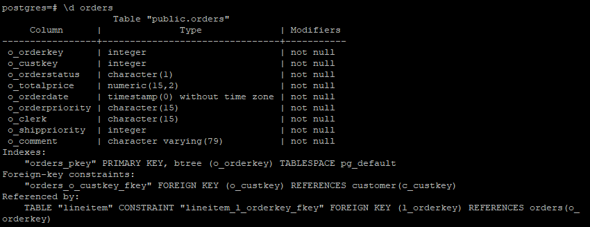

可以看到o_orderkey已经被成功设置为主键，o_curskey已经被成功设置为引用customer的外键，lineitem的l_orderkey也被成功设置为引用o_orderkey的外键。

### 2.5 实验总结

本次试验主要完成了表的创建和数据的导入，为后续对表格做各种操作的实验做准备。通过实践，本人掌握了数据库OpenGauss创建表格语句create的使用方法以及设置主键和外键约束的方法，了解该如何进行数据导入。

按照实验指导书的步骤一步一步完成基本没有遇到问题，只需要注意每完成一个步骤都需要检查一下这一步是否正确完成。每一步骤都有不同的检查方式。

## 3 数据查询与修改实验

### 3.1 实验目的

对前面实验建立的电商数据库关系表进行各种类型的查询操作和修改操作，加深对 SQL 语言中 DML的了解，掌握相关查询语句和数据修改语句的使用方法。

### 3.2 实验环境

本实验环境为 virtualBOX 虚拟机 openEuler20.03 系统上的 openGauss1.1.0/openGauss2.0.0 数据库，实验数据采用电商数据库的八张表

### 3.3 实验内容

* 单表简单查询，包括复合选择条件、结果排序、结果去重、结果重命名查询

* 多表查询，包括等值连接、自然连接、元组变量查询

* 统计查询，包括带有分组、聚集函数的查询

* 嵌套查询，包括带有 in/some/all、 exists、unique 的嵌套查询，from 中子查询

* with 临时视图查询

* 键/函数依赖分析

* 表的插入、删除、更新

### 3.4 实验步骤

#### 单表简单查询

**查询1：从订单表ORDERS表中，找出由收银员Clerk#000000951处理的满足下列条件的所有订单o_orderkey：**

* 订单总价位于[10000, 50000]
* 下单日期在'2020-01-01'至'2020-12-31'之间
* 订单状态 O_ORDERSTATUS 不为空

列出这些订单的订单 key（O_ORDERKEY）、客户 key、订单状态、订单总价、下单日期、订单优先级和发货优先级；

要求：对查询结果，按照订单优先级从高到低、发货优先级从高到低排序，并且将 O_ORDERDATE 重新命名为 O_DATE。

查询语句输入如下：

    select o_orderkey, o_custkey, o_orderstatus, o_totalprice, o_orderdate as o_date, o_orderpriority, o_shippriority
    from orders
    where o_clerk='Clerk#000000951'
    and o_totalprice between 10000 and 50000
    and o_orderdate between '2020-01-01'::date and '2020-12-31'::date
    and o_orderstatus is not null
    order by o_orderpriority desc, o_shippriority desc;

使用`EXPLAIN ANALYSE`语句可以获取查询所需时间和查询结果数量。一共获取8行数据，耗时105ms。

**查询2：从订单明细表 LINEITEM 表中，找出满足下列条件的所有订单 L_ORDERKEY：**

* 数量位于[10, 100]，
* 退货标志为‘N’的订单中，价格不小于10000

列出这些订单的 key 和零件供应商 key、价格；
要求：对查询结果，按照价格从高到低排序，并且对查询结果使用 distinct 去重。

比较对查询结果去重和不去重，在查询时间和查询结果上的差异。

去重的查询语句输入如下：

    select distinct l_orderkey, l_suppkey, l_extendedprice
    from lineitem
    where l_quantity between 10 and 100
    and l_returnflag='N'
    and l_extendedprice >= 10000
    order by l_extendedprice desc;

使用`EXPLAIN ANALYSE`语句对比去重和不去重的查询结果，发现去重和不去重的数量分别为498300和498304，仅仅有4行的差距。查询时间分别为1104ms和951ms，产生了150ms的差距，相当于不去重耗时的16%。

**查询3：从客户表 CUSTOMER 表中，找出满足下列条件的客户：**

* 客户电话开头部分包含‘10’，或者客户市场领域中包含“BUILDING”
* 客户电话结尾不为‘8’。

查询语句输入如下：

    select c_custkey
    from customer
    where (c_phone like '10%' or c_mktsegment like '%BUILDING%')
    and c_phone not like '%8';

使用`EXPLAIN ANALYSE`语句获得查询结果数为26915，查询时间为29ms。

**查询4：从客户表 CUSTOMER 表中，找出满足下列条件的客户姓名**

* 客户 key 由 2 个字符组成
* 客户地址至少包括 18 个字符，即地址字符串的长度不小于 18。

查询语句输入如下：

    select c_name
    from customer
    where c_custkey like '__'
    and length(c_address) >= 18;

使用`EXPLAIN ANALYSE`语句获得查询结果数为64，查询时间为41ms。

**查询5：使用集合并操作 union、union all，从订单明细表 LINEITEM 查询满足下列条件的订单 key**

* 订单发货日期早于‘2016-01-01’或者订单数量大于 100

对比 union all、union 操作在查询结果、执行时间上的差异

使用union all查询语句如下：

    select l_orderkey 
    from lineitem
    where l_shipdate < '2016-01-01'::date
    union all
    select l_orderkey
    from lineitem
    where l_quantity > 100;

使用union查询语句如下：

    select l_orderkey 
    from lineitem
    where l_shipdate < '2016-01-01'::date
    union
    select l_orderkey
    from lineitem
    where l_quantity > 100;

使用`EXPLAIN ANALYSE`语句获取到了两个查询语句的查询结果数分别为151587和41621，查询时间分别为916ms和667ms。由于union all保留了大量重复元祖，因此查询结果数和查询时间都要明显多于去重的union。

**查询6：结合教材 3.4.1 节元组变量样例，使用集合操作 except、except all，从供应商表 SUPPLIER 中，查询账户余额最大的供应商。**

对比使用 except、except all、聚集函数 max，对比完成此查询在执行时间、查询结果上的异同。

使用except查询语句如下：

    select s_suppkey
    from supplier 
    except(
      select t1.s_suppkey
      from supplier t1, supplier t2
      where t1.s_acctbal < t2.s_acctbal
    );

使用except all查询语句如下：

    select s_suppkey
    from supplier 
    except all(
      select t1.s_suppkey
      from supplier t1, supplier t2
      where t1.s_acctbal < t2.s_acctbal
    );

使用max查询语句如下：

    select s_suppkey, s_name
    from supplier
    where s_acctbal=(
      select max(s_acctbal)
      from supplier
    );

使用`EXPLAIN ANALYSE`语句获取到了三个查询语句的查询结果数分别为1、1和1，查询时间分别为2908ms、2583ms和1ms。三者的查询结果都为1个，但使用max语句的查询时间要远远小于使用except语句耗费的时间。

#### 多表查询

**查询7：选取两张数据量比较小的表 T1 和 T2，如地区表 REGION、国家表 NATION、供应商表 SUPPLIER，执行如下无连接条件的笛卡尔积操作，观察数据库系统的反应和查询结果：**

查询语句如下：

    select * from region, nation;

使用`EXPLAIN ANALYSE`语句获得查询结果数为125，查询时间为0.1ms。两个行数分别为5和25的表，产生了一张125行的表，表项依旧较少，因此耗时很短。

**查询8：使用多表连接操作（3.3.3 join/natural join，4.1.1 join），从订单表 ORDERS、供应商表 SUPPLIER、订单明细表 LINEITEM 中，查询实际到达日期小于预计到达日期的订单，列出这些订单的订单 key、订单总价、下单日期以及该供应商的姓名、地址和手机号。**

查询语句如下：

    select o_orderkey, o_totalprice, o_orderdate, s_name, s_address, s_phone
    from lineitem join orders on l_orderkey = o_orderkey join supplier on s_suppkey = l_suppkey
    where l_receiptdate < l_commitdate;

使用`EXPLAIN ANALYSE`语句获得查询结果数为133613，查询时间为790ms。

**查询9：使用多表连接操作，从供应商表 SUPPLIER、零部件表 PART、零部件供应表 PARTSUPP 中，查询供应零件品牌为‘Brand#13’的供应商信息，列出零件供应数量与成本，以及供应商的姓名与手机号。**

查询语句如下：

    select ps_availqty, ps_supplycost, s_name, s_phone
    from partsupp join supplier on ps_suppkey = s_suppkey join part on ps_partkey = p_partkey
    where part.p_brand = 'Brand#13';

使用`EXPLAIN ANALYSE`语句获得查询结果数为6424，查询时间为87ms。

**查询10：利用订单明细表 LINEITEM，使用教材 3.4.1 节元组变量 as/rename 方式，查询所有比流水号为“1”，订单号为“1”的折扣高的订单 key 和流水号，列出这些订单的零件、折扣，结果按照折扣的降序排列。**

查询语句如下：

    select l_orderkey as orderkey, 
    l_linenumber as linenumber, 
    l_partkey as partkey, 
    l_discount as discount
    from lineitem
    where l_discount > (
      select l_discount
      from lineitem
      where l_orderkey = '1'
      and l_linenumber = '1'
    )
    order by l_discount desc;

使用`EXPLAIN ANALYSE`语句获得查询结果数为655380，查询时间为1356ms。

#### 统计查询

**查询11：从订单明细表 LINEITEM、订单表 ORDERS、客户表 CUSTOMER、国家表 NATION，查询客户来自ALGERIA，下单日期为'2015-01-01'到'2015-02-02'的订单下列信息：**

* 满足条件订单的最大数量、最小数量和平均数量。
* 具有最大数量且满足上述条件的订单，列出该订单的发货日期、下单日期。

获取满足条件订单的最大数量、最小数量和平均数量的查询语句为：

    select max(l_quantity), min(l_quantity), avg(l_quantity)
    from lineitem join orders on l_orderkey = o_orderkey 
    join customer on o_custkey = c_custkey
    join nation on c_nationkey = n_nationkey
    where nation.n_name = 'ALGERIA'
    and orders.o_orderdate between '2015-01-01'::date and '2015-02-02'::date;

获得最大数量为50，最小数量为1，平均值约为25

具有最大数量且满足上述条件的订单，查询该订单的发货日期、下单日期的语句如下：

    select l_shipdate, o_orderdate
    from lineitem join orders on l_orderkey = o_orderkey 
    join customer on o_custkey = c_custkey
    join nation on c_nationkey = n_nationkey
    where nation.n_name = 'ALGERIA'
    and orders.o_orderdate between '2015-01-01'::date and '2015-02-02'::date
    order by l_quantity desc
    limit 1;

获得发货时间为2015-01-20，下单日期为2015-01-14

**查询12：根据零部件表 PART 和零部件供应表 PARTSUPP 和供应商表 SUPPLIER，查询有多少零件厂商提供了品牌为 Brand#13 的零件，给出这些零件的类型、零售价和供应商数量，并将查询结果按照零售价降序排列。**

查询语句如下：

    select p_type, p_retailprice, count(s_suppkey) as supplier_number
    from part join partsupp on ps_partkey = p_partkey 
    join supplier on ps_suppkey = s_suppkey
    where part.p_brand='Brand#13'
    group by p_type, p_retailprice
    order by p_retailprice desc;

使用`EXPLAIN ANALYSE`语句获得查询结果数为1349，查询时间为65ms。

**查询13：从零部件表 PART 和零部件供应表 PARTSUPP 中，查询所有零件大小在[7,14]之间的零件的平均零售价，给出零件 key，供应成本，平均零售价，结果按照零售价降序排列。**

查询语句如下：

    select p_partkey, ps_supplycost, avg(p_retailprice) as avgretailprice
    from part join partsupp on p_partkey = ps_partkey
    where part.p_size between 7 and 14
    group by p_partkey, ps_supplycost
    order by avgretailprice desc;

使用`EXPLAIN ANALYSE`语句获得查询结果数为26084，查询时间为173ms。

#### 嵌套查询

**查询14：：从订单明细表 LINEITEM、订单表 ORDERS、客户表 CUSTOMER 中，使用 set membership 运算符 in，查询明细折扣小于 0.01 的订单，列出这些订单的 key 和采购订单的客户姓名。**

对比使用多表连接、嵌套查询在执行时间、查询结果上的异同。

嵌套查询的查询语句如下：

    select o_orderkey, c_name
    from orders join customer on o_custkey = c_custkey
    where o_orderkey in(
        select l_orderkey 
        from lineitem
        where l_discount < 0.01);

多表查询查询语句如下：

    select distinct l_orderkey, c_name
    from orders join customer on c_custkey = o_custkey
    join lineitem on o_orderkey = l_orderkey
    where l_discount < 0.01;

使用`EXPLAIN ANALYSE`语句获取到了两个查询语句的查询结果数分别为90939和90939，查询时间分别为960ms和994ms。两者在耗时方面的差距并不是很大。

**查询15-1：从订单明细表 LINEITEM，使用 Set Comparison 运算符 some，查询满足下列条件的订单：该订单的数量大于发货日期在['2015-01-01','2015-02-02']之间的部分（至少一个）订单的数量，列出这些订单的流水号、key 和税。**

查询语句如下：

    select l_orderkey, l_linenumber, l_tax
    from lineitem
    where l_quantity > some (
        select l_quantity
        from lineitem
        where l_shipdate > '2015-01-01'::date
        and l_shipdate < '2015-02-02'::date
    );

使用`EXPLAIN ANALYSE`语句获得查询结果数为1176049，查询时间为17525ms。

**查询15-2：从订单表 ORDERS，使用 Set Comparison 运算符 some，查询满足下列条件的订单：订单状态为‘O’，订单总价大于部分在 2020 年之后下单的订单。列出这些订单的 key、客户 key、收银员。**

查询语句如下：

    select o_orderkey, o_custkey, o_clerk
    from orders
    where o_totalprice > some (
        select o_totalprice 
        from orders
        where o_orderdate >= '2020-01-01'::date)
        and o_orderstatus = 'O';

使用`EXPLAIN ANALYSE`语句获得查询结果数为146319，查询时间为847ms。

**查询16-1：从订单明细表 LINEITEM 中，使用 Set Comparison 运算符>=all，查询满足下列条件的供应商：该供应商在 2019 年出货量大于等于同时段其他供应商的出货量，即 2019 年该供应商的出货量最高。**

查询语句如下：

    select l_suppkey
    from lineitem
    where l_shipdate >= '2019-01-01'::date
    and l_shipdate <= '2019-12-30'::date
    group by l_suppkey
    having sum(l_quantity) >= all(
        select sum(l_quantity)
        from lineitem
        where l_shipdate >= '2019-01-01'::date
        and l_shipdate <= '2019-12-30'::date
        group by l_suppkey
    );

得到供应商key为370。

**查询 16-2：供应商表 SUPPLIER，使用 Set Comparison 运算符 all，查询账户余额大于等于其他供应商的供应商。列出该供应商的姓名、key、手机号。**

查询语句如下：

    select s_suppkey, s_name, s_phone
    from supplier
    where s_acctbal >= all(
        select s_acctbal
        from supplier
    );

得到该供应商的姓名为 Supplier#000000892 ，key为
892， 手机号为 18-893-665-3629

**查询 17-1：从供应商表 SUPPLIER、国家表 NATION，使用 Test for Empty Relations 运算符“exists”，查询国家为日本，账户余额大于 5000 的供应商。**

查询语句如下：

    select s_suppkey
    from supplier
    where exists(
        select * 
        from nation
        where n_nationkey = s_nationkey
        and n_name = 'JAPAN'
        and s_acctbal > 5000
    );

使用`EXPLAIN ANALYSE`语句获得查询结果数为42，查询时间为1.4ms。

**查询 17-2：从客户表 CUSTOMER、国家表 NATION、订单表 ORDERS、订单明细表 LINEITEM、供应商表SUPPLIER 中，使用 Test for Empty Relations 运算符“not exists except”，查询满足下列条件的供应商：该供应商不能供应所有的零件。**

查询语句如下：

    select s_suppkey
    from supplier
    except(
        select s_suppkey
        from supplier
        where not exists(
            select p_partkey
            from part
            except(
                select ps_partkey 
                from partsupp
                where ps_suppkey = s_suppkey
            )
        )
    );

使用`EXPLAIN ANALYSE`语句获得查询结果数为2000，查询时间为90578ms。

**查询 18：从国家表 NATION、客户表 CUSTOMER 中，使用“count”，查询满足下列条件的国家：至少有 3个客户来自这个国家，并列出该国家的国家 key 和国家名。**

查询语句如下：

    select n_nationkey, n_name
    from nation join customer on n_nationkey = c_nationkey
    group by n_nationkey, n_name
    having count(c_custkey) >= 3;

只有一个查询结果，该国家key为0，国家名为ALGERIA

**查询 19：从零部件表 PART 和零部件供应表 PARTSUPP 中，使用 Subqueries in the From Clause 方法，查询满足下列条件的零件：零件由 2 个以上的供应商供应，且零件大小在 20 以上。**

查询语句如下：

    select ps_partkey
    from (
        select ps_partkey
        from partsupp
        group by ps_partkey
        having count(ps_suppkey) > 2
    ) 
    join part on p_partkey = ps_partkey
    where p_size > 20;

使用`EXPLAIN ANALYSE`语句获得查询结果数为23757，查询时间为141ms。

#### with 临时视图查询

**查询 20：用 with 临时视图方式，实现查询 19 中查询要求。**

查询语句如下：

    with temp as(
        select ps_partkey
            from partsupp
            group by ps_partkey
            having count(ps_suppkey) > 2)
    select ps_partkey
    from temp join part on p_partkey = ps_partkey
    where p_size > 20;

使用`EXPLAIN ANALYSE`语句获得查询结果数为23757，查询时间为179ms。

**查询 21：从零部件供应表 PARTSUPP 中，用 with 临时视图方式，查询零件供应数量最多的供应商 key 和其供应的数量。**

查询语句如下：

    with temp as(
        select ps_suppkey, sum(ps_availqty) as sum_num
        from partsupp
        group by ps_suppkey
    )
    select ps_suppkey, sum_num
    from temp
    where sum_num = (
        select max(sum_num)
        from temp
    );

使用`EXPLAIN ANALYSE`语句获得查询结果数为2000和供应商数量一样多，所有供应商供应任意零件数量的总合都为80，查询时间为76ms。

#### 键/函数依赖分析

**查询 22：在订单明细表 LINEITEM 中，检查订单 key、零件 key、供应商 key、流水号是否组成超键。**

查询语句如下：

    select l_orderkey, l_partkey, l_suppkey, l_linenumber
    from lineitem
    group by l_orderkey, l_partkey, l_suppkey, l_linenumber
    having count(*) > 1;

结果为空，因此订单 key、零件 key、供应商 key、流水号组成超键。

**查询 23：在订单明细表 LINEITEM 中，利用 SQL 语句检查函数依赖零件 key→价格是否成立；如果不成立，利用 SQL 语句找出导致函数依赖不成立的元组。**

以下为查询语句：

    select *
    from lineitem
    where l_partkey in(
    select l_partkey
    from lineitem
    group by l_partkey
    having count(distinct l_extendedprice) > 1);

使用`EXPLAIN ANALYSE`语句获得查询结果数为1199969，查询时间为3887.795ms。因此key→价格不成立。

#### 表的插入、删除、更新

**查询 24：向订单表 ORDERS 中插入一条订单数据；**

插入语句如下：

    insert into orders values('1200001', '20045', 'F', 61365.24, '2017-03-19'::date, '2-HIGH', 
    'Clerk#000000098', 0, 'furiously special f');

使用查询语句`select * from orders where o_orderkey = 1200001;`可以查询这条插入的元组

**查询 25：将零件 32 的全部供应商，作为零件 20 的供应商，加入到零部件供应表 PARTSUPP 中。**

插入语句如下：

    insert into partsupp(
        select '20', ps_suppkey, ps_availqty, ps_supplycost, ps_comment
        from partsupp
        where ps_partkey = '32'
        and ps_suppkey not in(
            select ps_suppkey
            from partsupp
            where ps_partkey = '20'
        )
    );

在插入前后使用以下查询语句

    select * 
    from partsupp
    where ps_partkey = '20';

发现插入前查询结果行数为4

插入后的行数为8

对比以下查询语句的结果：

    select * 
    from partsupp
    where ps_partkey = '32';

查询结果行数为4，除了ps_partkey其他属性刚好与插入后比插入前的差值，证明插入成功。

**查询 26：在订单明细表 LINEITEM 中，删除已退货的订单记录。(returnflag='R')**

以下为删除语句：

    delete from lineitem
    where l_returnflag = 'R';

使用以下查询语句

    select * 
    from lineitem
    where l_returnflag = 'R';

查询结果为0，说明删除成功。

**查询 27：用订单明细表 LINEITEM 中在 2019 年之后交易中的预计到达日期，替换表中的实际到达日期。**

以下为更新语句：

    update lineitem
    set l_receiptdate = l_commitdate
    from orders
    where l_orderkey = o_orderkey
    and o_orderdate >= '2020-01-01'::date;

使用以下查询语句

    select * 
    from lineitem join orders on l_orderkey = o_orderkey
    where l_receiptdate != l_commitdate 
    and o_orderdate >= '2020-01-01'::date;

查询结果为0，说明更新成功。

**查询 28：针对订单明细表 LINEITEM、订单表 ORDERS，使用 update/case 语句做出如下修改：如果订单的订单优先级低于 medium，则其在订单明细表中的预计到达日期推后 2 天, 否则推迟一天。**

以下为更新语句：

    update lineitem
    set l_commitdate = case 
        when l_orderkey in (
            select o_orderkey 
            from orders
            where o_orderpriority = '4-NOT SPECIFIED' 
            or o_orderpriority = '5-LOW'
        ) 
        then l_commitdate + '2 day'
        else l_commitdate + '1 day'
    end;

查询使用更新语句前后的lineitem表格，发现订单优先级为not specified或low的订单l_commitdate多了两天，其余订单多了一天，说明更新成功。

**查询 29：在订单表 ORDERS 中，按照订单总价对订单进行降序排序，并输出订单 key 和排名。**

以下为查询语句：

select o_orderkey, o_totalprice, rank() over(order by o_totalprice desc) as ‘Rank’
from ORDERS;

查询结果按o_totalprice降序排列，新增Rank列显示订单的排名。

### 3.5 实验总结

通过本次实践，本人基本掌握了查询语句的各种使用方式和场景，基本掌握了插入、删除和更新操作，学会通过查询语句判断函数依赖关系。

实验中遇到的一个问题就是由于查询结果一般数量巨大，实验结果难以表示。因此，实验结果主要通过使用`EXPLAIN ANALYZE`语句获取查询结果行数和查询所需时间来展现。同时，对于需要对比的查询语句，`EXPLAIN ANALYZE`语句也可用于对比不同查询语句的表现。

## 4 数据库完整性约束实验

### 4.1 实验目的

了解 SQL 语言和 openGauss 数据库提供的完整性（integrity）机制，通过实验掌握面向实际数据库建立实体完整性、参照完整性、断言、函数依赖等各种完整性约束的方法，验证各类完整性保障措施。

### 4.2 实验环境

本实验环境为 virtualBOX 虚拟机 openEuler20.03 系统上的openGauss1.1.0/openGauss2.0.0 数据库和华为云 GaussDB(openGauss)数据库，实验数据采用电商数据库的八张表。

### 4.3 实验内容

在前面完成的实验中已建立了本实验所需的 8 张表。本实验将针对这 8 张表，采用 create table、alter table 等语句，添加主键、候选键、外键、check 约束、默认/缺省值约束，并观察当用户对数据库进行增、删、改操作时，DBMS 如何维护完整性约束。

* 建立完整性约束
* 主键/候选键/空值/check/默认值约束验证
* 外键/参照完整性验证分析
* 函数依赖
* 触发器

### 4.4 实验步骤

#### 建立完整性约束

创建lineitem表格副本，并使用`Create table`建立完整性约束。以下是创建语句：

    CREATE TABLE LINEITEMcopy1(
    L_ORDERKEY integer NOT NULL,
    L_PARTKEY integer NOT NULL,
    L_SUPPKEY integer NOT NULL,
    L_LINENUMBER integer NOT NULL,
    L_QUANTITY DECIMAL(15,2) NOT NULL,
    L_EXTENDEDPRICE DECIMAL(15,2) NOT NULL,
    L_DISCOUNT DECIMAL(15,2) NOT NULL,
    L_TAX DECIMAL(15,2) NOT NULL,
    L_RETURNFLAG CHAR(1) NOT NULL,
    L_LINESTATUS CHAR(1) NOT NULL,
    L_SHIPDATE DATE NOT NULL,
    L_COMMITDATE DATE NOT NULL,
    L_RECEIPTDATE DATE NOT NULL,
    L_SHIPINSTRUCT CHAR(25) NOT NULL,
    L_SHIPMODE CHAR(10) NOT NULL,
    L_COMMENT VARCHAR(44) NOT NULL,
    PRIMARY KEY (L_ORDERKEY, L_LINENUMBER),
    FOREIGN KEY (L_PARTKEY) REFERENCES PART(P_PARTKEY),
    FOREIGN KEY (L_SUPPKEY) REFERENCES SUPPLIER(S_SUPPKEY)
    );

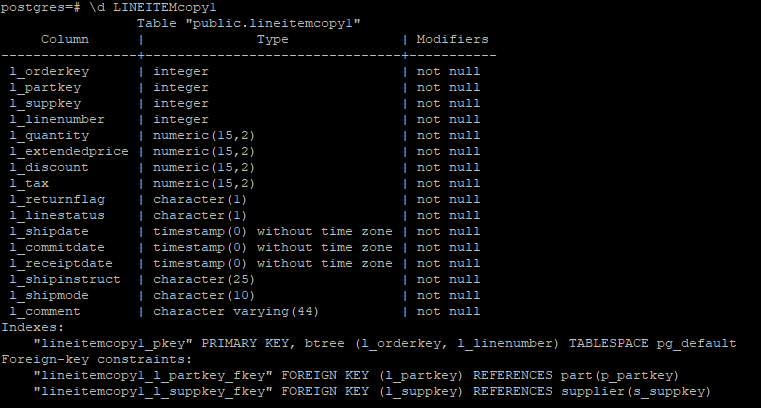

可以看到完整性约束建立成功。

接着在创建另一个不带约束的lineitem表格副本LINEITEMcopy2，改用`alter table`添加约束。

设置主键为L_ORDERKEY和L_LINENUMBER：

    alter table LINEITEMcopy2 add constraint LINEITEMcopy2_PKEY primary key (L_ORDERKEY, L_LINENUMBER);

设置外键L_PARTKEY引用自PART：

    alter table LINEITEMcopy2 add constraint LINEITEMcopy2_L_PARTKEY_FKEY foreign key (L_PARTKEY) references PART;

设置外键L_SUPPKEY引用自SUPPLIER：

    alter table LINEITEMcopy2 add constraint LINEITEMcopy2_L_SUPPKEY_FKEY foreign key (L_SUPPKEY) references SUPPLIER;

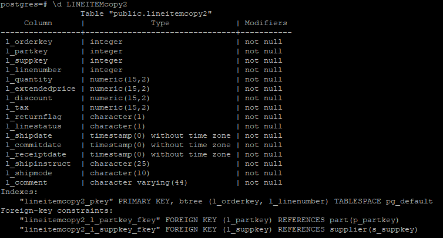

可以看到成功建立了和LINEITEMcopy1一样的完整性约束

#### 主键约束验证

将LINEITEM数据全部插入到表LINEITEMcopy1后，使用查询语句判断LINEITEMcopy1是否满足主键约束，以下为查询语句：

    Select l_orderkey, count(*)
    From lineitemcopy1
    Group by (l_orderkey, l_linenumber)
    Having count(*)>1;

返回结果为0行，说明表中无重复主键的数据。

使用查询语句判断是否含有主键为空的数据：

    select *
    from lineitemcopy1
    where l_orderkey is null
    and l_linenumber is null;

返回结果为0行，说明表中无主键为空的数据。

尝试插入主键为空的数据：

    INSERT INTO lineitemcopy1
    values(null,0,0,null,0,0,0,0, 'a', 'b', '2020-01-01'::date,'2020-01-12'::date, '2020-01-15'::date,'name3', 'name4', 'name5');

主键约束会自动为l_orderkey添加非空值约束，因此发生错误：
   
    ERROR:  null value in column "l_orderkey" violates not-null constraint

尝试修改原有数据行 l_orderkey, l_linenumber 字段为空

    UPDATE lineitemcopy1
    SET l_orderkey=null, l_linenumber=null
    WHERE l_orderkey =1 and l_linenumber=5;

发生错误：
   
    ERROR:  null value in column "l_orderkey" violates not-null constraint

尝试修改原有数据行 l_orderkey 字段和 l_linenumber 字段与表中已有其它元组的主属性取值相同：

    UPDATE lineitemcopy1
    SET l_linenumber =2
    WHERE l_orderkey=1 and l_linenumber=1;

由表中已存在l_orderkey=1 and l_linenumber=2的数据行，产生主键相同的数据行，因此发生错误：
    
    ERROR:  duplicate key value violates unique constraint "lineitemcopy1_pkey"

尝试插入主键重复的数据：

    INSERT INTO lineitemcopy1
    values(1,0,0,2,0,0,0,0, 'a', 'b', '2020-01-01'::date,
    '2020-01-01'::date, '2020-01-01'::date,'name3', 'name4', 'name5');

发生错误：

    ERROR:  duplicate key value violates unique constraint "lineitemcopy1_pkey"

#### 空值约束验证

尝试插入一行l_extendedprice字段为空的数据

    INSERT INTO lineitemcopy1
    values(1,0,0,2,0,null,0,0, 'a', 'b', '2020-01-01'::date,
    '2020-01-01'::date, '2020-01-01'::date,'name3', 'name4', 'name5');

发生错误，l_extendedprice字段为空违反非空约束

    ERROR:  null value in column "l_extendedprice" violates not-null constraint

尝试修改原有数据行l_extendedprice字段为空

同样发生错误

    ERROR:  null value in column "l_extendedprice" violates not-null constraint

#### 外键完整性约束

为方便起见，和前文中lineitem一样，分别创建关系表orders和customer的副本orderscopy和customercopy，并仅创建这两个表之间的外键约束，即`FOREIGN KEY (o_custkey) REFERENCES customercopy1(c_custkey)`，然后将数据导入进去

使用查询语句判断两表间是否满足参照完整性约束：

    select count(O_CUSTKEY)
    from orderscopy1
    where O_CUSTKEY not in (
        select C_CUSTKEY
        from customercopy1
    );

输出count为0，因此两表满足参照完整性约束。

尝试向orderscopy表中插入一行数据，其O_CUSTKEY值设为0

    insert into orderscopy1
    values(1200001,0,'O',181580, '2019-01-02'::date,'5-LOW','Clerk#000000406',0,'special f');

由于customercopy表中不存在C_CUSTKEY值为0的数据行，违反了外键约束，因此插入失败：

    ERROR:  insert or update on table "orderscopy1" violates foreign key constraint "orderscopy1_o_custkey_fkey"

尝试将orderscopy表中一行O_CUSTKEY值为7828的数据的O_CUSTKEY字段值修改为31000

    UPDATE orderscopy1
    SET O_CUSTKEY=31000
    WHERE O_CUSTKEY=7828;

由而customercopy表中并没有C_CUSTKEY值为31000的数据行，因此违反了外键约束，更新失败

    ERROR:  insert or update on table "orderscopy1" violates foreign key constraint "orderscopy1_o_custkey_fkey"

**在非级联外键约束条件下**

尝试将customercopy表中一行C_CUSTKEY值为29980的数据的 C_CUSTKEY字段值修改为31001：

    UPDATE customercopy1
    SET C_CUSTKEY=31001
    WHERE C_CUSTKEY=29980;

由于orderscopy中存在O_CUSTKEY值为29980的数据行，违反外键约束，执行出错：

    ERROR:  update or delete on table "customercopy1" violates foreign key constraint "orderscopy1_o_custkey_fkey" on table "orderscopy1"

从customercopy表中删除C_CUSTKEY值为29980的数据行：

    delete from customercopy1
    where C_CUSTKEY=29980;

由于orderscopy中存在O_CUSTKEY值为29980的数据行，违反外键约束，执行出错

    ERROR:  update or delete on table "customercopy1" violates foreign key constraint "orderscopy1_o_custkey_fkey" on table "orderscopy1"

**在级联外键约束条件下**

为了重新定义级联的外键约束，首先删除原来的外键约束

    alter table orderscopy1
    drop constraint orderscopy1_o_custkey_fkey;

重新定义orderscopy和customercopy之间的级联关联如下：

    alter table orderscopy1
    add constraint FK_O_CUSTKEY
    foreign key(O_CUSTKEY) references customercopy1(C_CUSTKEY)
    on delete cascade
    on update cascade;

再次尝试将customercopy表中一行C_CUSTKEY值为29980的数据的C_CUSTKEY字段值修改为31001，此时就更新成功了。

查看ORDERS中O_CUSTKEY值为29980和31001的数据行：

    select *
    from orderscopy1
    where O_CUSTKEY=29980;
    select *
    from orderscopy1
    where O_CUSTKEY=31001;

由于ORDERS中O_CUSTKEY值为29980的数据行的值也跟着改为31001，因此两个查询分别返回0和37个数据项。

再次从customercopy表中删除C_CUSTKEY值为31001的数据行，也同样删除成功。

查看ORDERS中O_CUSTKEY值为31001的数据行，返回0项数据，说明ORDERS中O_CUSTKEY值为31001的数据行也跟着被删除了。

这就是级联和非级联的区别，级联外键关联下，当被参照关系中的主键发生修改，删除时，参照关系中的外键会跟着进行相应地修改，删除。

#### 函数依赖分析验证

可以使用查询语句判断函数依赖P_BRAND→P_MFGR是否满足：

    select max(a) as a_MFGR
    from(
        select count(DISTINCT P_MFGR) as a
        from part
        group by P_BRAND
    );

返回值为1，因此对于P_BRAND值相同的所有数据行，其P_MFGR值最多只有一个。满足函数依赖P_BRAND→P_MFGR。

#### 触发器约束

由于触发器中禁止增删改操作的嵌套使用，因此为了完成实验需求，再对lineitemcopy表进行一个备份，新表为lineitemcopy_new。为了验证触发器正确性，删除新表上的相关约束。在实际应用中需保持两表的数据一致性，本实验仅验证触发器效果。

首先需要创建将新数据插入到lineitemcopy中的触发器函数：

    CREATE OR REPLACE FUNCTION tri_insert_func() RETURNS TRIGGER AS 
    $$ DECLARE BEGIN 
    INSERT INTO lineitemcopy1
    VALUES (new.L_ORDERKEY, new.L_PARTKEY,new.L_SUPPKEY,new.L_LINENUMBER,new.L_QUANTITY,new.L_EXTENDEDPRICE,
    new.L_DISCOUNT, new.L_TAX, new.L_RETURNFLAG, new.L_LINESTATUS, new.L_SHIPDATE, new.L_COMMITDATE,
    new.L_RECEIPTDATE, new.L_SHIPINSTRUCT, new.L_SHIPMODE, new.L_COMMENT);
    RETURN NEW; 
    END $$ LANGUAGE PLPGSQL;

然后在lineitemcopy_new上定义插入触发器，如果发货日期满足发货日期必须在预计到达日期和实际到达日期之前，则插入到 lineitemcopy中，若不满足条件，则不进行插入操作：

    CREATE TRIGGER insert_trig_before BEFORE INSERT ON lineitemcopy1_new for EACH ROW
    WHEN(new.l_shipdate <= new.l_commitdate and new.l_shipdate <= new.l_receiptdate)
    EXECUTE PROCEDURE tri_insert_func();

此时尝试向lineitemcopy_new插入一行数据，发货日期为2020年1月2日，预计到达日期和实际到达日期均为2020年1月1日。

    INSERT INTO lineitemcopy1_new
    values(4,0,0,2,0,0,0,0, 'a', 'b', '2020-01-02'::date,
    '2020-01-01'::date, '2020-01-01'::date,'name3', 'name4', 'name5');

使用查询语句分别检查表lineitemcopy1_new和表lineitemcopy：

    select *
    from lineitemcopy1_new
    where l_orderkey=4 and l_linenumber=2;
    select *
    from lineitemcopy1
    where l_orderkey=4 and l_linenumber=2;

发现语句成功插入到表lineitemcopy1_new，但由于不满足约束条件，没有插入到lineitemcopy中。

再插入一行发货日期为2020年1月2日，预计到达日期为2020年1 月3日，实际到达日期均为2020年1月4日的数据：

    INSERT INTO lineitemcopy1_new
    values(4,1,1,3,0,0,0,0, 'a', 'b', '2020-01-02'::date,'2020-01-03'::date, '2020-01-04'::date,'name3', 'name4', 'name5');

再次使用查询语句分别检查表lineitemcopy1_new和表lineitemcopy，由于满足约束，数据成功插入到两个表中。

再创建一个触发器函数用于修改改发货日期：

    CREATE OR REPLACE FUNCTION tri_update_func() RETURNS TRIGGER AS 
    $$ DECLARE BEGIN
    UPDATE lineitemcopy1 
    SET L_SHIPDATE =new. L_SHIPDATE
    WHERE old. L_ORDERKEY = new. L_ORDERKEY and old. L_LINENUMBER = new. L_LINENUMBER;
    RETURN NEW; 
    END $$ LANGUAGE PLPGSQL;

同样对lineitemcopy_new设置一个更新触发器，插入前比较发货日期与预计到达日期、实际到达日期，当发货日期满足约束时，将新值更新到lineitemcopy对应行中，否则不进行更新：

    CREATE TRIGGER updata_trig_before BEFORE UPDATE ON lineitemcopy1_new for EACH ROW
    WHEN(new.l_shipdate <= new.l_commitdate and new.l_shipdate <= new.l_receiptdate)
    EXECUTE PROCEDURE tri_update_func();

将刚才插入的订单 key 为 4，流水号为 3 的数据进行修改，发货日期新值为 2019-02-01：

    UPDATE lineitemcopy1_new
    SET l_shipdate='2019-02-01'::date
    WHERE l_orderkey=4 and l_linenumber=3;

由于满足条件，使用之前的查询语句分别检查表lineitemcopy1_new和表lineitemcopy，发现在两张表中数据都同样更新成功了。

再将订单key为4，流水号为3的数据进行修改，PCI新值为 2020-02-01：

    UPDATE lineitemcopy1_new
    SET l_shipdate='2020-02-01'::date
    WHERE l_orderkey=4 and l_linenumber=3;

使用之前的查询语句分别检查表lineitemcopy1_new和表lineitemcopy，由于不满足条件，只有lineitemcopy1_new的数据项更新成功。

### 4.5 实验总结

通过本次实践，本人基本掌握了为表添加完整性约束的方法，学会通过查询语句判断完整性约束的正确性。通过实践，进一步了解了级联和非级联的区别。最后还尝试使用了触发器实现条件检测与过程的触发。

## 5 数据库接口实验

### 5.1 实验目的

* 通过编写数据库应用程序，培养数据库应用程序开发能力
* 熟悉数据库应用程序设计的多种接口的配置，培养相关的软件配置能力

### 5.2 实验环境

本实验环境为 virtualBOX 虚拟机 openEuler20.03 系统上的openGauss1.1.0/openGauss2.0.0 数据库和华为云 GaussDB(openGauss)数据库，实验数据采用电商数据库的八张表。

### 5.3 实验内容

* 了解通用数据库应用编程接口（例如 JDBC、ODBC 等）的配置方法
* 利用 C、Java 等高级程序设计语言编程实现简单的数据库应用程序，掌握基于 ODBC、JDBC 接口的数据库访问的基本原理和方法，访问 TPC-H 数据库，执行查找、增加、删除、更新等操作，掌握基于应用编程接口的数据库访问方法。

本次实验选择使用JDBC完成接口实验。

### 5.4 实验步骤

首先需要为本地数据库配置好监听信息。

通过gs命令语句将监听地址改为"*"（即全部）：

    gs_guc reload -N db1 -I all -c "listen_addresses='*'"

通过gs命令语句在数据库主节点配置文件中加入与IP地址对应的认证规则:

    gs_guc reload -N all -I all -h "host all all 192.168.56.1/32 sha256"

然后下载OpenGauss驱动包，并加入到IDEA工程中。

由于使用初始用户omm连接数据可会报错：

    FATAL: Forbid remote connection with initial user.

因此需要创建一个新用户：

    create user ascian password 'Ascian871';

并将在所有表格上的所有权限授予给他：

    grant all privilege to ascian;

随后就可以通过编写java程序方式访问数据库。

**查询**

以下为获取表nation所有数据的java程序：

    import java.sql.*;

    public class Main{
        static final String JDBC_DRIVER = "org.postgresql.Driver";
        static final String DB_URL = "jdbc:postgresql://192.168.56.104:26000/postgres?ApplicationName=app1";
        static final String USER = "ascian";
        static final String PASS = "Ascian871";
        public static void main(String[] args) {
            System.out.println("java版本号："+ System.getProperty("java.version"));
            Connection conn = null;
            Statement stmt = null;
            try{
                // 注册 JDBC 驱动
                Class.forName(JDBC_DRIVER);

                // 打开链接
                System.out.println("连接数据库...");
                conn = DriverManager.getConnection(DB_URL,USER,PASS);
                // 执行查询
                System.out.println(" 实例化Statement对象...");
                stmt = conn.createStatement();
                String sql;
                sql = "select n_nationkey ,n_name, n_regionkey, n_comment from nation";
                ResultSet rs = stmt.executeQuery(sql);
                System.out.print("nationkey name regionkey comment\n" );

                // 展开结果集数据库
                while(rs.next()){
                    // 通过字段检索
                    int nationkey = rs.getInt("n_nationkey");
                    String name = rs.getString("n_name");
                    int regionkey = rs.getInt("n_regionkey");
                    String comment = rs.getString("n_comment");

                    System.out.printf(" %-5d %-15s %-5d %s\n",nationkey ,name.trim(), regionkey,
                            comment);
                }
                // 完成后关闭
                rs.close();
                stmt.close();
                conn.close();
            }catch(SQLException se){
                // 处理 JDBC 错误
                se.printStackTrace();
            }catch(Exception e){
                // 处理 Class.forName 错误
                e.printStackTrace();
            }finally{
                // 关闭资源
                try{
                    if(stmt!=null) stmt.close();
                }catch(SQLException se2){
                }
                try{
                    if(conn!=null) conn.close();
                }catch(SQLException se){
                    se.printStackTrace();
                }
            }
        }
    }

运行结果如下：

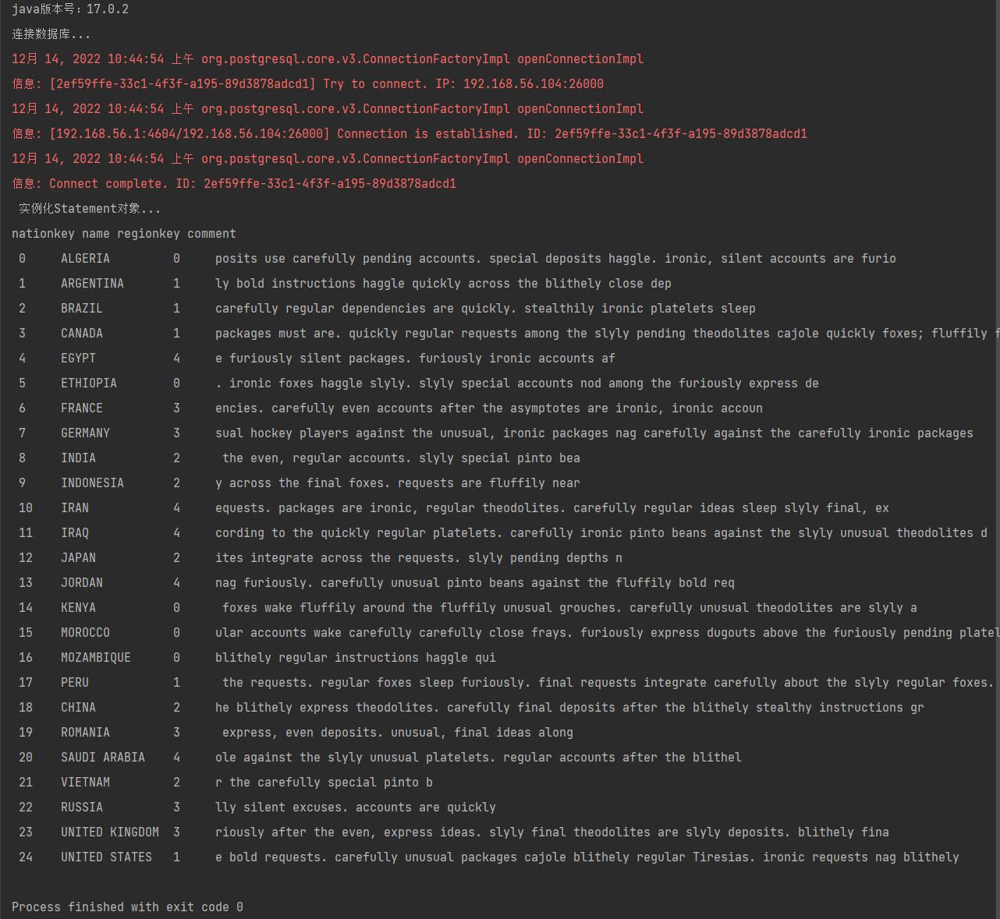

**插入**

插入一条n_nationkey为25，n_name为South Korea，n_regionkey为3的数据到数据库中只需将原java程序中的

    String sql;
    sql = "select n_nationkey ,n_name, n_regionkey, n_comment from nation";
    ResultSet rs = stmt.executeQuery(sql);

改为

    stmt.executeUpdate("insert into nation values(25, 'South Korea', 3);");
    ResultSet rs = stmt.executeQuery("select * from nation where n_nationkey = 25;");

运行结果如下：

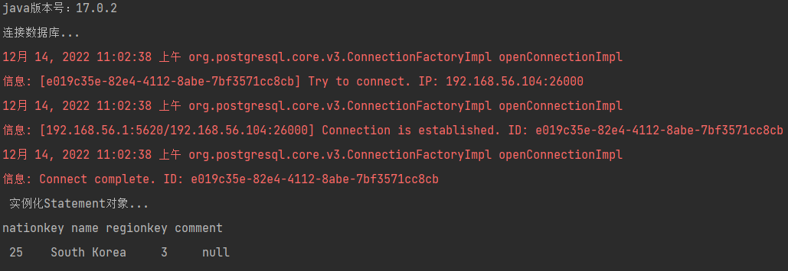

**更新**

将之前插入的数据中的n_regionkey更新为2，只需将`stmt.executeUpdate("insert into nation values(25, 'South Korea', 3);");`改为`stmt.executeUpdate("update nation set n_regionkey = 2 where n_nationkey = 25;");`

运行结果如下：

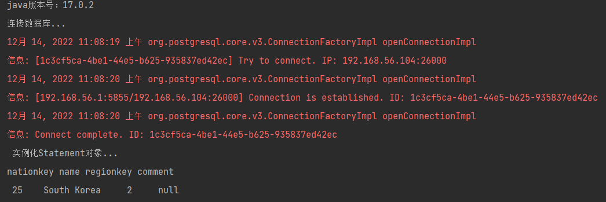

**删除**

删除之前插入的数据，只需将`stmt.executeUpdate("update nation set n_regionkey = 2 where n_nationkey = 25;");`改为`stmt.executeUpdate("delete from nation where n_nationkey = 25;");`

运行结果如下，返回了0条数据：

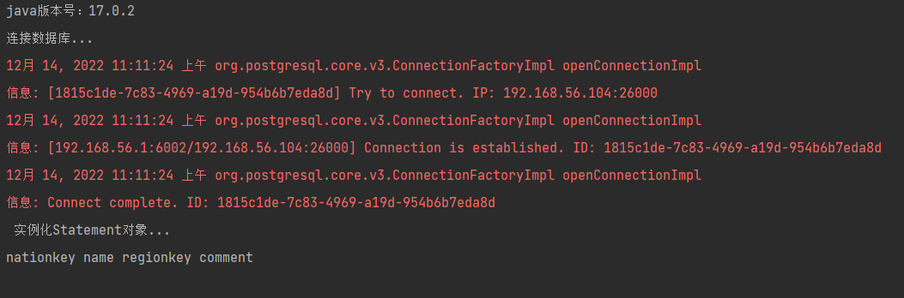

    
### 5.5 实验总结

通过本次实践，本人基本掌握了使用java语言JDBC接口访问数据的方法，并尝试编写了程序对数据库表格进行查询，插入，更新和删除操作。

实验中遇到的第一个问题就是在对openGauss本地数据库配置好监听信息后，java程序依旧无法连接上数据库，报错`FATAL: Connection to 192.168.56.104:26000 refused. Check that hostname and port are correct and that the postmaster is accepting TCP/IP connection.`。分析原因是由于配置修改还未生效导致，使用命令`gs_om -t restart`重启数据库后，java程序便可以成功连接上数据库。

第二个问题就是java程序无法使用初始omm用户访问数据库，需要新创建一个用户，并将所用权限赋予给他。通过这个新用户才可以正常访问数据库。

最后一个问题就是，插入、删除和更新这类修改数据库的语句，应当使用`executeUpdate`函数执行。若使用`executeQuery`函数执行，虽然也能执行成功，但会报错`org.postgresql.util.PSQLException: 查询没有传回任何结果`，导致程序没法继续正常运行。

## 6 数据库物理文件实验

### 6.1 实验目的

* 掌握用 winSCP 连接 openEuler 系统
* 学会在本地与 openEuler 间上传与下载文件
* 了解数据库日志文件的类型和作用
* 能够针对日志文件进行一些简单的操作和管理维护

### 6.2 实验环境

本实验环境为 virtualBOX 虚拟机 openEuler20.03 系统上 openGauss1.1.0/openGauss2.0.0 数据库

### 6.3 实验内容

* 安装 WinSCP
* 使用 WinSCP 连接 OpenEuler
* 查看运行时日志
* 查看安装和卸载时日志
* 查看操作日志
* 配置审计项
* 查看审计结果
* 维护审计日志
* 查看WAL日志
* 查看性能日志

### 6.4 实验步骤

由于在数据导入实验中，已经成功使用 WinSCP 连接数据库，并成功传输本地主机文件到虚拟机中，这里就不在展示WinSCP的使用步骤。

数据库物理文件有数据文件与日志文件，日志文件又分为系统日志，操作日志，trace 日志，黑匣子日志，审计日志，WAL 日志，性能日志。

|类型|说明|
|---|---|
|系统日志|数据库运行时产生的日志，记录系统进程的异常信息|
|操作日志|通过客户端工具（例如gs_guc）操作数据库时产生的日志|
|Trace日志|打开数据库的调试开关后，会记录大量的Trace日志。这些日志可以用来分析数据库的异常信息|
|黑匣子日志|数据库系统崩溃时，通过故障现场堆、栈信息可以分析出故障发生时的进程上下文，方便故障定位。黑匣子具有在系统崩溃时，dump 出进程和线程的堆、栈、寄存器信息的功能|
|审计日志|开启数据库审计功能后，将数据库用户的某些操作记录在日志中，这些日志称为审计日志。|
|WAL日志|又称REDO日志，在数据库异常损坏时，可以利用WAL日志进行回复。由于WAL日志的重要性，所以需要经常备份这些日志。|
|性能日志|数据库系统在运行时检测物理资源的运行状态的日志，在对外部资源进行访问时的性能检测，包括磁盘、Hadoop openGauss等外部资源的访问检测信息|

系统日志又分为 openGauss 运行时数据库节点产生的日志和 openGauss 安装部署时产生的日志。

#### 运行时日志

通过 WinSCP 打开文件夹路径`/var/log/gaussdb/omm/pg_log/dn_6001`，文件夹内便是运行时日志。

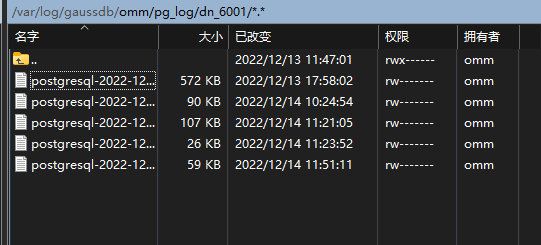

运行时日志的命名规则为：postgresql-创建时间.log。默认情况下，每日 0 点或者日志文件大于 16MB 或者数据库实例（数据库节点）重新启动后，会生成新的日志文件。

日志内容的默认格式为：日期+时间+时区+用户名称+数据库名称+会话 ID+日志级别+日志内容

若要在虚拟机内查看，切换到用户 omm 使用命令`cd /$gaussdbLogPath/omm/pg_log/dn_6001`也可查看到运行时日志文件，其中`$gaussdbLogPath`即为`/var/log/gaussdb`。

使用`cat`命令即可查看文件内容。

#### 安装和卸载时日志

通过 WinSCP 打开文件夹路径`/var/log/gaussdb/omm/om`，文件夹内便是安装和卸载时日志。

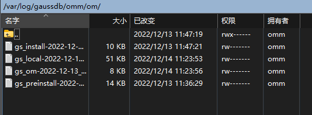

若要在虚拟机内查看，切换到用户 omm 使用命令`cd /$gaussdbLogPath/omm/om`也可查看到安装和卸载时日志文件。

#### 操作日志

通过 WinSCP 打开文件夹路径`/var/log/gaussdb/omm/bin。

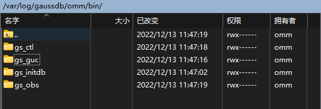

文件夹内包含四种文件夹，每个文件夹对应一个工具的操作日志，以 gs_guc 操作为例，打开文件夹`gs_guc`，内部便是 gs_guc 的操作日志文件。

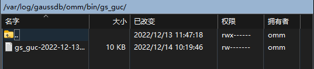

操作日志的命名规则为:历史日志文件名为"工具名-日志创建时间间.log"，当前日志文件名为"工具名-日志创建时间-current.log"。如果日志大小超过 16MB，在下一次调用该工具时，会重命名当前日志文件为历史日志文件，并以当前时间生成新的当前日志文件。

若要在虚拟机内查看，切换到用户 omm 使用命令`cd /$gaussdbLogPath/omm/bin`也可查看到操作日志文件。

#### 审计日志

首先需要配置审计项。

审计配置项一共包含以下几类：

|配置项|描述|
|---|---|
|用户登录、注销审计|参数：audit_login_logout。默认值为 7，表示开启用户登录、退出的审计功能。设置为 0 表示关闭用户登录、退出的审计功能。不推荐设置除 0 和 7 之外的值。|
|数据库启动、停止、恢复和切换审计|参数：audit_database_process。默认值为 1，表示开启数据库启动、停止、恢复和切换的审计功能。|
|用户锁定和解锁审计|参数：audit_user_locked。默认值为 1，表示开启审计用户锁定和解锁功能。|
|用户访问越权审计|参数：audit_user_violation。默认值为 0，表示关闭用户越权操作审计功能。|
|授权和回收权限审计|参数：audit_grant_revoke。默认值为 1，表示开启审计用户权限授予和回收功能。|
|数据库对象的 CREATE，ALTER，DROP 操作审计|参数：audit_system_object。默认值为 12295，表示只对 DATABASE、SCHEMA、USER、DATA SOURCE 这四类数据库对象的 CREATE、ALTER、DROP 操作进行审计。|
|具体表的 INSERT、UPDATE 和 DELETE 操作审计|参数：audit_dml_state。默认值为 0，表示关闭具体表的 DML 操作（SELECT 除外）审计功能。|
|SELECT 操作审计|参数：audit_dml_state_select。默认值为 0，表示关闭 SELECT 操作审计功能。|
|COPY 审计|参数：audit_copy_exec。默认值为 1，表示开启 copy 操作审计功能。|
|存储过程和自定义函数的执行审计|参数：audit_function_exec。默认值为 0，表示不记录存储过程和自定义函数的执行审计日志。|
|SET 审计|参数：audit_set_parameter。默认值为 1，表示记录 set 操作审计日志|
|审计文件的存储目录|参数：audit_directory。默认值为 $gaussdbLogPath/用户名/pg_audit|
|审计日志的保存策略|参数：audit_resource_policy。默认值为 on，表示使用空间配置策略|
|审计文件占用的磁盘空间总量|参数：audit_space_limit。默认值为 1GB|
|审计日志文件的最小保存时间|参数：audit_file_remain_time。默认值为 90|
|审计目录下审计文件的最大数量|参数：audit_file_remain_threshold。默认值为 1048576|

可以命令`SHOW audit_enabled;`检查审计总开关状态。

返回结果为 on，因此审计总开关处于打开状态。

若审计总开关为关，退出数据库后可以使用命令`gs_guc set -N all -I all -c "audit_enabled=on"`打开总审计开关。

可以使用`SHOW 审计项参数`的方式检查各审计项参数，例如输入命令`SHOW audit_login_logout;`

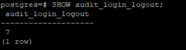

若需要修改审计项，退出数据库后输入命令`gs_guc reload -N all -I all -c "audit_login_logout=0"`可以修改 audit_login_logout 值变为 0。

当需要审计的审计项开关都已经开启后，就可以使用 select 语句查看审计结果了。

使用 select 语句`SELECT * FROM pg_query_audit('2022-12-13 00:00:00','2022-12-15 00:00:00');`可以查看到所需时间范围内的审计记录：

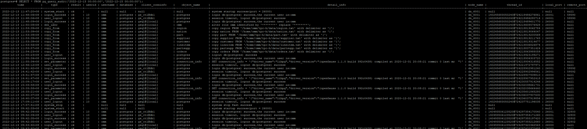

由于审计功能开启时会不断产生大量的审计日志，占用磁盘空间当审计文件占用的磁盘空间或者审计文件的个数超过指定的最大值时，系统将删除最早的审计文件，并记录审计文件删除信息到审计日志中。

可以通过语句`SHOW audit_space_limit;`查看审计文件占用磁盘空间的最大值：

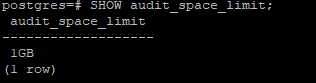

可以使用前文中修改审计项的方法修改最大值。

数据库同样也提供了手动删除审计日志的方法，使用 select 语句`SELECT pg_delete_audit(2022-12-13 00:00:00','2022-12-14 00:00:00');`，能够将指定时间范围内的记录删除。

若需要备份审计日志，可以先查看审计日志物理位置`SHOW audit_directory;`，然后退出数据库后，使用copy语句`cp -r /var/log/gaussdb/omm/pg_audit/dn_6001 /var/log/gaussdb/omm/pg_audit/dn_6001_bak`将审计日志目录拷贝保存。

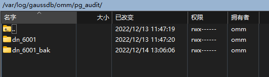

#### WAL日志

通过 WinSCP 打开文件夹路径`/gaussdb/data/db1/pg_xlog`，文件夹内便是WAL日志。

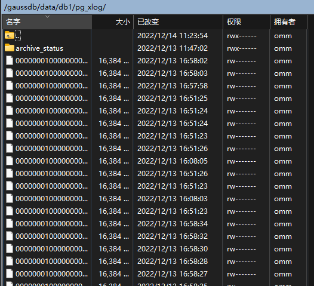

WAL 日志的命名规则为：日志文件以段文件的形式存储的，每个段为 16MB，并分割成若干页，每页 8KB。每个段文件的名称由 24 个十六进制组成，分为三个部分，每个部分由 8 个十六进制字符组成(这些数字一般情况下是顺序增长使用的，但也存在循环使用的情况)。第一部分表示时间线，第二部分表示日志文件标号，第三部分表示日志文件的段标号。

若要在虚拟机内查看，切换到用户 omm 使用命令`cd $dataNode/pg_xlog`也可查看到WAL日志文件，`$dataNode`即`/gaussdb/data/db1`。

#### 性能日志

通过 WinSCP 打开文件夹路径`/var/log/gaussdb/omm/gs_profile/dn_6001`，文件夹内便是性能日志。

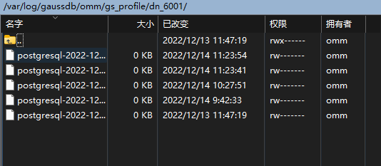

性能日志的命名规则为：postgresql-创建时间.prf。默认情况下，每日 0 点或者日志文件大于 20MB 或者数据库实例（数据库节点）重新启动后，会生成新的日志文件。

日志内容的默认格式为：主机名称+日期+时间+实例名称+线程号+日志内容。

若要在虚拟机内查看，切换到用户 omm 使用命令`cd /var/log/gaussdb/omm/gs_profile`也可查看到性能日志文件。

### 6.5 实验总结

通过本次实验，本人了解了各种日志的区别和作用，并学会如何查看各类日志的内容。同时，了解了审计日志的作用，学会如何通过配置审计项获取需要的日志信息，懂得如何删除，备份审计日志。

按照实验指导书的流程完成实验，并没有遇到什么问题。

## 7 数据库物理设计实验

### 7.1 实验目的

* 学会创建多个表空间，并在不同的表空间上创建对象
* 对表空间进行查询，删除等管理操作
* 学会创建分区表，并向表中插入数据，进行观察
* 对分区表进行重命名，删除等管理操作
* 学会在普通表上创建管理索引
* 学会在分区表上创建管理索引

### 7.2 实验环境

本实验环境为 virtualBOX 虚拟机 openEuler20.03 系统上的 openGauss1.1.0/openGauss2.0.0 数据库

### 7.3 实验内容

* 创建表空间
* 管理表空间
* 创建分区表
* 管理分区表
* 普通表上创建管理索引
* 分区表上创建管理索引

### 7.4 实验步骤

#### 创建表空间

首先创建表空间:

    CREATE TABLESPACE fastspace RELATIVE LOCATION 'tablespace/tablespace_1';

其中`fastspace`为新创建的表空间，`$dataNode/pg_location/tablespace/tablespace_1_`是用户拥
有读写权限的空目录。

使用如下命令可以将表空间的`CRAETE`权限赋予用户：

    GRANT CREATE ON TABLESPACE fastspace TO ascian;

在`create`语句中加入`tablespace`就可以在特定的表空间上创建表：

    CREATE TABLE table_1(i int) TABLESPACE fastspace;

可以通过以下语句设置默认表空间：

    SET default_tablespace = 'fastspace';

未来不加`tablespace`的`create`语句就会将表创建在表空间`fastspace`内。

#### 管理表空间

使用如下语句可以查询到全部表空间：

    SELECT spcname FROM pg_tablespace;

或者使用 gsql 程序的元命令`\db`

使用以下命令可以查询表空间当前使用情况：

     SELECT PG_TABLESPACE_SIZE('fastspace');

使用以下命令可以为表空间重命名：

    ALTER TABLESPACE fastspace RENAME TO example;

使用以下命令可以删除表空间：

    DROP TABLESPACE example;

由于只有当表空间为空时才允许删除表空间，由于创建了表`table_1`，报错`ERROR:  tablespace "example" is not empty`

#### 创建分区表

第一种方法，使用`VALUES LESS THAN`的方式，语法格式如下：

    PARTITION BY RANGE(partition_key)
    (
        PARTITION partition_name VALUES LESS THAN ( { partition_value | MAXVALUE } ),
        ...
    )

创建一个 orders 的分区表：

    create table partition_orders_1(
    o_orderkey integer,
    PRIMARY KEY (o_orderkey)
    )
    partition by range(o_orderkey)
    (
    partition p1 values less than(100),
    partition p2 values less than(200),
    partition p3 values less than(300),
    partition p4 values less than(maxvalue)
    );

使用可以`select`命令列出各分区情况:

    select relname,parttype,parentid,boundaries from pg_partition where parentid in(select oid from pg_class 
    where relname='partition_orders_1');

第二种方法，使用`START END`的方式，语法格式如下：

    PARTITION BY RANGE(partition_key)
    (
        PARTITION partition_name {START(partition_value) END(partition_value) EVERY(interval_value)} | {START(partition_value) END(partition_value | MAXVALUE)} | {START(partition_value)} | {END(partition_value | MAXVALUE)},
        ...
    )

创建一个 orders 的分区表：

    create table partition_orders_2(
    o_orderkey integer,
    PRIMARY KEY (o_orderkey)
    )
    partition by range(o_orderkey)
    (
    partition p1 start(2) end(100) every(10),
    partition p2 end(200),
    partition p3 end(300),
    partition p4 start(300),
    partition p5 start(400),
    partition p6 start(500) end(600)
    );

使用可以`select`命令列出各分区情况

第二种方法，使用` INTERVAL`的方式，语法格式如下：

    PARTITION BY RANGE(partition_key)
    NTERVAL ('interval_expr') [STORE IN (tablespace_name [, ... ])]
    (
        ...
    )

创建一个 orders 的分区表：

    create table partition_orders_3(
    o_orderkey integer,
    o_orderdate date,
    PRIMARY KEY (o_orderkey, o_orderdate)
    )
    partition by range(o_orderdate)
    interval('1 day')
    (
    partition p1 values less than('2021-03-08 00:00:00'),
    partition p2 values less than('2021-03-09 00:00:00')
    );

一开始创建的分区只有 p1,p2，若向表中插入入键值不在已有分区范围内的元组`insert into partition_orders_3 values (1, '2021-03-11 00:00:00');`

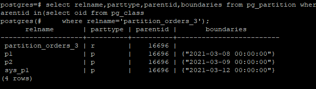

可见，自动生成了 1 个新的分区，上界为 ‘2021-03-12 00:00:00’，与插入元组间隔为 1 day。

在创建分区时加上`tablespace`语句就可以设置分区所在表空间：

    create table partition_orders_4(
    o_orderkey integer,
    PRIMARY KEY (o_orderkey)
    )
    tablespace example2
    partition by range(o_orderkey)
    (
    partition p1 values less than(100),
    partition p2 values less than(200) tablespace example4,
    partition p3 values less than(300),
    partition p4 values less than(maxvalue)
    );

此分区表，分区 p1，p3，p4 都在表空间 example2 中，而分区 p2 在表空间 example4 中

#### 管理分区表

删除单个分区：

    ALTER TABLE partition_orders_4 DROP PARTITION p4;

添加分区：

     ALTER TABLE partition_orders_4 ADD PARTITION p_4 VALUES LESS THAN(MAXVALUE);

重命名分区：

     ALTER TABLE partition_orders_4 RENAME PARTITION p3 TO p_3;

修改分区原来的表空间：

     ALTER TABLE partition_orders_4 MOVE PARTITION p1 TABLESPACE example4;

以上操作的结果如下

查询单独分区内的数据：

    SELECT * FROM partition_orders_4 PARTITION(p2);

或者

     SELECT * FROM partition_orders_4 PARTITION FOR(150);

`partition for` 括号内的数值为所选分区范围内的任意值，如果定义分区时分区键不只一个，那么此括号内的数值个数应该与定义分区时使用的分区键个数相同，并且一一对应

####  普通表上创建管理索引

首先创建建 orders 表的备份 orderscopy2，并将数据导入。

对于 orderscopy2 表，需要经常使用查询条件`WHERE o_totalprice>10000`，可以使用以下命令创建普通索引：

     CREATE INDEX orderscopy2_index_totalprice ON orderscopy2(o_totalprice);

创建多字段索引：

    CREATE INDEX orderscopy2_index_more_column ON orderscopy2(o_orderstatus, o_totalprice);

创建部分索引：

     CREATE INDEX orderscopy2_part_index ON orderscopy2(o_orderstatus) WHERE o_orderstatus='O';

创建表达式索引：

    CREATE INDEX orderscopy2_para_index ON orderscopy2(reverse(o_clerk) varchar_pattern_ops);

可以使用如下命令查询系统和用户定义的所有索引：

    SELECT RELNAME FROM PG_CLASS WHERE RELKIND='i';

查询指定索引的信息:

    \di+ orderscopy2_index_totalprice;

重命名索引:

     ALTER INDEX orderscopy2_index_more_column RENAME TO orderscopy2_index_orderstatus_totalprice;

删除索引:

     DROP INDEX orderscopy2_para_index;

#### 分区表上创建管理索引

首先以 orders 表为例创建一个分区表 partition_orders_0。

创建 GLOBAL 索引：

    create index global_index_custkey on partition_orders_0(o_custkey) global tablespace example2;

用 WinSCP 可以看到，只有一个索引文件。

创建不指定索引分区名称的 LOCAL 索引：

    create index local_index_totalprice on partition_orders_0(o_totalprice) local tablespace example3;

用 WinSCP 看出，有 4 个索引文件。

创建指定索引分区名称的 LOCAL 索引：

    create index local_index_shippriority on partition_orders_0(o_shippriority) local
    (
    partition p1_index,
    partition p2_index,
    partition p3_index tablespace example4,
    partition p4_index tablespace example4
    ) tablespace example3;

用 WinSCP 看到，分别在 example3 有 2 个索引文件和 example4 有 2 个索引文件。

修改索引分区所在的表空间：

    ALTER INDEX local_index_shippriority MOVE PARTITION p1_index TABLESPACE example2;

重命名索引分区：

    ALTER INDEX local_index_shippriority RENAME PARTITION p2_index TO p2_index_new;

删除索引，要删除索引只能删除整个索引，不能删除单独的分区索引：

    drop index global_index_custkey;

### 7.5 实验总结

通过本实验学会了表空间和分区表的使用使用和管理方法，并了解了分别在普通表和分区表上创建索引的方法。

按照实验指导书的流程完成实验，并没有遇到什么问题。

## 8 数据库查询优化实验

### 8.1 实验目的

在 openGauss 平台下，通过观察 Select/Insert/delete/update 等 SQL 语句的查询执行计划，分析查询执行计划中连接、选择、投影等关系代数操作的实现方式及其执行成本。熟悉了解 openGauss 数据库中查询优化的使用，理解数据库查询优化的基本概念。

掌握利用 explain 命令，分析对比形式不同、执行结果等价的不同 SQL 语句的查询执行计划的执行成本和执行时间差异。

熟悉了解视图和 with 临时视图的创建，观察视图查询、with 临时视图查询的执行计划。

参照教科书中 SQL 语句查询优化相关内容，在多种情况下，对比实现方式不同但查询结果相同的等价SQL 语句在执行计划和成本方面的差异，加深对查询优化的理解，进行书写优化 SQL 语句的初步训练，提高编写高效 SQL 语句的能力。

### 8.2 实验环境

本实验环境为 virtualBOX 虚拟机 openEuler20.03 系统上的 openGauss1.1.0/openGauss2.0.0 数据库，实验数据采用 TPC-H 电商数据库的八张表。

### 8.3 实验内容

* 执行计划的查看与分析
* 观察视图查询、with 临时视图查询的执行计划
* 优化 SQL 语句

### 8.4 实验步骤

#### 执行计划的查看与分析

使用`EXPLAIN`查看查询计划，查询订单明细表中，使用了零件 key 为 1 的订单价格和订单状态：

    EXPLAIN 
    select A.l_extendedprice ,C.o_orderstatus
    from lineitem as A, part as B, orders as C
    where A.l_partkey = B.p_partkey and A.l_orderkey=C.o_orderkey and B.p_partkey =1;

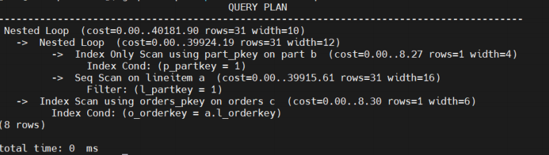

第一层：Seq Scan on lineitem a，表扫描算子，在表 a 上执行全表顺序扫描，扫描检查的条件是 l_partkey=1,这一层的作用是把表 a 符合检查条件的数据从 buffer 或者磁盘上读上来输送给上层节点参与计算。预计执行时间（本层）为 0-39915.61 毫秒，预计输出的行数为 31 行。

第二层：Index Only Scan using part_pkey on part b，表扫描算子，在表 b 上执行主键上的索引扫描（表 b 在建立时创建过主键索引）。扫描检查的条件是 l_partkey=1，这一层的作用是把表 b 符合检查条件的数据从 buffer 或者磁盘上读上来输送给上层节点参与计算。预计执行时间（本层）为 0-8.27 毫秒，预计输出的行数为 1 行。

第三层：Nested Loop，表连接算子，主要作用是将第一层输出的数据和第二层输出的数据通过嵌套循环的方式连接，并输出结果数据。预计执行时间（整个查询的总时间）为 0-39924.19 毫秒，预计输出的行数为 31 行。

第四层：Index Scan using orders_pkey on orders c，表扫描算子，在表 c 上执行主键上的索引扫描（表 c 在建立时创建过主键索引）。扫描检查的条件是 c.o_orderkey=a.l_orderkey，这一层的作用是把表 c 符合检查条件的数据从 buffer 或者磁盘上读上来输送给上层节点参与计算。预计执行时间（本层）为 0-8.30 毫秒，预计输出的行数为 1 行。

第五层：Nested Loop，表连接算子，主要作用是将第三层输出的数据和第四层输出的数据通过嵌套循环的方式连接，并输出结果数据。预计执行时间（整个查询的总时间）为 0-40181.90 毫秒，预计输出的行数为 31 行。

#### 观察视图查询、with 临时视图查询的执行计划

在 orders 上建立视图:

    CREATE VIEW orders_view
    AS 
    SELECT *
    FROM orders;

通过视图进行查询：

    EXPLAIN ANALYZE
    SELECT o_orderkey
    FROM orders_view;  

通过with临时视图进行查询:

    EXPLAIN ANALYZE
    WITH orders_temview AS(
    SELECT *
    FROM orders
    )
    SELECT o_orderkey
    FROM orders_temview;

不用视图直接查询:

    EXPLAIN ANALYZE
    SELECT o_orderkey
    FROM orders;

3个执行计划对比可发现，针对以上的3个查询，通过建立视图来查询和不用视图直接查询，实际的执行计划是相同的，执行时间也相似。但是通过with临时视图查询，执行计划会有所不同，所花费的执行时间也更长。

原因在于，第一个查询中，提前建立好了orders_view视图，对orders_view视图的直接查询，在执行中，转变成了对orders的顺序扫描，而在第三个查询中，对orders的直接查询，也是对orders的顺序扫描，则两个查询中的执行过程是一样的（都只有顺序扫描这一层），执行时间自然也相似。在第二个查询中，执行计划一共有2层，第一层是对orders进行顺序扫描，并将扫描出的数据存在临时创建的通用表表达式orders_temview中（CTE它是一种临时结果集），第二层再通过对orders_temview进行扫描来得到查询结果。由于多了第二层，执行时间也更长了。

#### 优化 SQL 语句

**复合索引左前缀**

创建 lineitem 的备份表 lineitem_New（没有主键，没有索引，没有约束）。

在 lineitem_new 创建组合索引（l_quantity, l_tax,l_extendedprice）：

    CREATE index lineitem_index
    ON lineitem_new(l_quantity, l_tax,l_extendedprice);

使用最左前缀索引查询，查询 l_quantity=24 的全部数据:

    explain analyze
    select *
    from lineitem_new
    where l_quantity=24;

在不使用索引的情况：

    explain analyze
    select * 
    from lineitem
    where l_quantity=24;

使用不含最左前缀的索引查询，查询 l_tax=0.02 的全部数据:

    explain analyze
    select *
    from lineitem_new
    where l_tax=0.02;

不使用索引:

    explain analyze
    select * 
    from lineitem
    where l_tax=0.02;

查询结果一致，但查询时间有很大差距，不使用索引的查询时间 > 使用不含最左前缀的索引的查询时间 > 使用最左前缀索引的查询时间。

**多表连接操作，在连接属性上建立索引**

删除上个实验的索引，再在 l_suppkey 和 l_partkey 上创建 2 个索引。

不使用 l_suppkey 索引，l_suppkey=10 ,列举在 orders 中找到的此订单的订单总价:

    EXPLAIN ANALYZE
    select DISTINCT l_suppkey,s_phone
    from lineitem, supplier
    where l_suppkey=10 AND l_suppkey=supplier.s_suppkey;

使用 l_suppkey 索引查询:

    EXPLAIN ANALYZE
    select DISTINCT l_suppkey,s_phone
    from lineitem_new, supplier
    where l_suppkey=10 AND l_suppkey=supplier.s_suppkey;

使用 l_partkey 索引查询:

    EXPLAIN ANALYZE
    select DISTINCT l_partkey,p_name
    from lineitem_new, part
    where l_partkey= 928 AND l_partkey=part.p_partkey;

查询结果一致，但不使用索引的查询时间 > 使用索引的查询时间，可知，在两表连接上，建立恰当的索引，可以节省查询时间。

**索引对小表查询的作用**

创建supplier的不带主键索引的备份表supplier_new。

无索引查询supplier_new：

    explain 
    select s_suppkey
    from supplier_new;

强制使用索引查询 supplier:

    set enable_seqscan=off;
    explain 
    select s_suppkey
    from supplier;

强制使用索引开销会增大很多，对于较小的表不建立索引反而查询会更快。

**查询条件中函数对索引的影响**

先删除上面实验建立的索引，再在 l_discount 和 l_quantity 上创建 2 个索引

查询条件中使用函数进行查询：

    explain
    select distinct B.l_orderkey
    FROM lineitem_new as A, lineitem_new as B
    where A.l_extendedprice = 16473.51
    and A.l_discount =0.04
    and ABS(A.l_quantity-B.l_quantity)<20;

查询条件中不使用函数进行查询:

    explain
    select distinct B.l_orderkey
    FROM lineitem_new as A, lineitem_new as B
    where A.l_extendedprice = 16473.51
    and A.l_discount =0.04
    and B.l_quantity >A.l_quantity -20
    and B.l_quantity <A.l_quantity +20;

第一个执行计划使用了 l_discount 上的索引，而没有使用 l_quantity 上的索引，从而查询效率更低，第二个执行计划两个索引都使用了，从而查询效率更高。可知，很多情况下，当索引上存在函数计算时，索引就不起作用了，可转换为等价的没有函数计算的实现方式，来提高查询效率。

**多表嵌入式 SQL 查询**

嵌套查询：

    explain analyze
    select A.p_name
    from part as A
    where A.p_partkey IN(
    select B.ps_partkey
    from partsupp as B
    where B.ps_suppkey=1002
    );

连接查询:

    explain analyze
    select A.p_name
    from part as A,partsupp as B
    where B.ps_suppkey=1002
    AND A.p_partkey =B.ps_partkey;

一般在使用多表查询的时候应该避免使用嵌套查询，但在实际应用中有时会出现两种情况性能相同甚至是嵌套查询性能更优的情况。

**where 查询条件中复合查询条件 OR 对索引的影响**

删除上面实验的索引，并创建索引 l_quantity。

含有“A OR B”查询条件的 select 语句：

    explain
    select *
    from lineitem_new
    where l_tax=0.06 AND (l_quantity=36 OR l_discount=0.09);

等价的 2 条 select 语句的 union：

    explain
    (select *
    from lineitem_new
    where l_tax=0.06 AND l_quantity=36)
    UNION
    (select *
    from lineitem_new
    where l_tax=0.06 AND l_discount=0.09);

含有union的语句执行效率更低，从执行计划来看，第一个语句因为where条件中引入了OR而使得索引不再起作用，但是后一个查询步骤繁多，虽然使用索引，但是却还是进行了全表扫描，效率反而更低。

**聚集运算中的索引设计**

删除上面实验创建的索引，并分别在l_suppkey和l_extendedprice创建索引。

无索引聚集运算：

    explain
    select l_suppkey,avg(l_extendedprice) as avg_extendedprice
    from lineitem
    group by l_suppkey;

有索引聚集运算:

    explain
    select l_suppkey,avg(l_extendedprice) as avg_extendedprice
    from lineitem_new
    group by l_suppkey;

强制使用索引后，聚集运算:

    set enable_seqscan=off;
    explain
    select l_suppkey,avg(l_extendedprice) as avg_extendedprice
    from lineitem_new
    group by l_suppkey;

上述例子，有索引的表在查询时没有使用索引（优化器在检测到使用索引查询效率反而更低时，会自动不使用索引），第一个查询和第二个查询的执行计划基本相同，查询效率也基本相同。在有索引的表上强制使用索引后，第三个查询的执行计划采取了索引扫描，查询效率更低，查询速度更慢。

**Select 子句中有无 distinct 的区别**

无distinct查询:

    explain analyze
    select o_orderkey
    from orders
    where o_orderstatus='O'
    and o_orderpriority='4-NOT SPECIFIED';

有distinct查询;

    explain analyze
    select distinct o_orderkey
    from orders
    where o_orderstatus='O'
    and o_orderpriority='4-NOT SPECIFIED';

以上两个查询的查询结果是一样的（因为o_orderkey是主键，本身就没有重复的），但是有distinct的查询的执行计划，比无distinct的查询的执行计划，多了按o_orderkey进行散列聚集的操作，从而使得有distinct的查询效率要比无distinct的查询效率更低，使用distinct有时反而会增大开销。

**union、union all 的区别**

使用union进行查询：

    explain analyze
    select p_partkey from part
    union
    select ps_partkey from partsupp;

使用union all进行查询:

    explain analyze
    select p_partkey from part
    union all
    select ps_partkey from partsupp;

两次查询的查询结果不一样，第一次查询结果的数据要远远少于第二次查询结果的数据，第二次查询结果中有大量的重复数据，但是第二次查询效率要高于第一次的查询效率，union all的性能要优于union。

**from 中存在多余的关系表，即查询非最简化**

没有多余关系表:

    explain analyze
    select distinct orders.o_custkey
    from lineitem,orders
    where lineitem.l_orderkey=orders.o_orderkey;

增加了一个多余的关系表tbCell和对应的连接条件:

    explain analyze
    select distinct orders.o_custkey
    from lineitem,orders,part
    where lineitem.l_orderkey=orders.o_orderkey and lineitem.l_partkey=part.p_partkey;

两次查询的结果完全一致，但是第一次查询的查询效率远远高于第二次查询，增加多余的表会大大的增加开销。

### 8.5 实验总结

通过本次试验，我了解到了很多查询语句细小差别造成的影响。不同的查询语句即使得到了相同的结果，查询时间也会由较大的差异。个人认为本次试验，对于日后编写高效的查询语句有较大的作用。

按照实验指导书的流程完成实验，并没有遇到什么问题。

## 9 事务及其并发控制实验

### 9.1 实验目的

通过单事务、串行事务、并发事务实验，了解 openGauss 数据库中

* 事务组成方式和执行模式；
* 对单事务和串行事务的原子性保障机制；
* 基于锁和隔离级别的事务并发控制和对并发事务的一致性、独立性保障机制。

### 9.2 实验环境

本实验环境为 virtualBOX 虚拟机 openEuler20.03 系统上的 openGauss1.1.0/openGauss2.0.0 数据库，实验数据采用 TPC-H 供应商和采购商数据库的八张表。

### 9.3 实验内容

* 通过 update 操作对现有关系表进行修改，观察违反 check 约束的 update 执行结果，理解 openGauss 对单个事务提供的原子性保障机制；
* 在 openGauss 两种事务执行模式下，完成串行事务提交与回滚实验，对数据库表进行查询（select）、更新（update）、插入(insert)、删除(delete)，了解 openGauss 事务组成方式和 commit/rollback 对查询结果的影响，了解数据库内容/状态发生变化时 openGauss 提供的事务原子性的保障机制；
* 在显式执行模式下，通过串行执行多个事务，对现有数据库表增加、删除属性列，观察 commit/rollback对执行结果的影响，了解数据库模式结构发生变化时 openGauss 提供的事务原子性保障机制；
* 观察单事务或串行事务中保存点（Save Point）回滚 rollback 对数据库访问结果的影响，了解 openGauss保存点机制；
* 观察 openGauss 的加锁机制，包括对数据库、关系表、数据行等不同粒度的数据对象所施加的各种不同类型的锁；
* 了解 openGauss 提供的各种事务隔离级别。观察分析在“读提交”隔离级别下，并发事务执行导致的数据不一致性，如丢失修改（写-写错误）、读脏数据（写-读错误）、不可重复读（读-写错误）、幻象；
* 分析对比多种隔离级别下，如“读提交”与“可重复读”，并发事务执行导致的数据不一致性，了解 openGauss提供的事务一致性和独立性保障机制。

### 9.4 实验步骤

#### 单事务与串行事务

**违反 check 约束的 update 操作**

为方便起见，创建 partsupp 表的副本 partsupp_1，partsupp_2，并将 partsupp 表的数据导入进去。

然后添加约束保证 PS_AVAILQTY >=0：

    alter table partsupp_1 add constraint partsupp_chk_1 check(PS_AVAILQTY >=0);
    alter table partsupp_2 add constraint partsupp_chk_2 check(PS_AVAILQTY >=0);

对于零件供应数量小于 10 的数据将 PS_AVAILQTY 设置为当前值减去 8：

    update partsupp_1
    set PS_AVAILQTY=PS_AVAILQTY-8
    where PS_AVAILQTY<10;

报错

    ERROR:  new row for relation "partsupp_1" violates check constraint "partsupp_chk_1"
    DETAIL:  Failing row contains (1, 2, -7, 771.64, , even theodolites. regular, final theodolites eat after the car...).

且使用查询语句发现更新前后数据么有发生变化。

然后尝试将实验内容在 partsupp_2 表上组织成事务执行：

    START TRANSACTION;
    select *
    from partsupp_2
    where PS_AVAILQTY<10;
    update partsupp_2
    set PS_AVAILQTY=PS_AVAILQTY-8
    where PS_AVAILQTY<10;
    select *
    from partsupp_2
    where PS_AVAILQTY<10;
    END;

依旧报和之前一样的错，且更新之后的查询语句由于事务的回滚并没有执行，报错`ERROR:  current transaction is aborted, commands ignored until end of transaction block, firstChar[Q]`。再次用查询语句发现数据项为发生改变。

当执行 update 语句之后发现报错，check 约束不合法，会导致回滚，单语句顺序执行的话，会导致单语句回滚，事务执行的话，则是整个事务回滚，说明当有 check 约束时，某行更新失败会使得整条语句（或者整个事务）全部回滚，并非是只跳过 check 不通过的那些行。

**事务 commit/rollback 操作**

以 commit 结束的 T1 事务：

    START TRANSACTION;
    select PS_PARTKEY,PS_SUPPLYCOST
    from partsupp_1
    where PS_PARTKEY between '2020' and '2022';
    update partsupp_1
    set PS_SUPPLYCOST=200
    where PS_PARTKEY between '2020' and '2022';
    select PS_PARTKEY,PS_SUPPLYCOST
    from partsupp_1
    where PS_PARTKEY between '2020' and '2022';
    commit;

共查询到 12 条数据，并将 PS_SUPPLYCOST 更新为 200，更新成功，并将事务提交。

再次使用查询语句发现数据为更新后的语句。

以 rollback 结束的 T1 事务：

    START TRANSACTION;
    select PS_PARTKEY,PS_SUPPLYCOST
    from partsupp_2
    where PS_PARTKEY between '2020' and '2022';
    update partsupp_2
    set PS_SUPPLYCOST=200
    where PS_PARTKEY between '2020' and '2022';
    select PS_PARTKEY,PS_SUPPLYCOST
    from partsupp_2
    where PS_PARTKEY between '2020' and '2022';
    rollback;

共查询到 12 条数据，并将 EARFCN 更新为 38950，更新成功，并将事务回滚。

使用查询语句发现数据为更新前的语句，事务回滚后，更新无效。

**修改数据库模式**

以 commit 结束删除 PS_AVAILQTY 列：

    START TRANSACTION;
    alter table partsupp_1 drop column PS_AVAILQTY;
    COMMIT;

查看 PS_AVAILQTY 列：

    select PS_AVAILQTY from partsupp_1;

报错：

    ERROR:  column "ps_availqty" does not exist
    LINE 1: select PS_AVAILQTY from partsupp_1;
               ^
    CONTEXT:  referenced column: ps_availqty

事务提交后，删除操作有效。

以 rollback 结束删除 PS_AVAILQTY 列：

    START TRANSACTION;
    alter table partsupp_2 drop column PS_AVAILQTY;
    ROLLBACK;

查看 PS_AVAILQTY 列发现该列未被删除，事务回滚，删除操作无效。

以 commit 结束增加 PS_AVAILQTY_NEW 列:

    START TRANSACTION;
    alter table partsupp_1 add column PS_AVAILQTY_NEW integer;
    COMMIT;

查看 PS_AVAILQTY_NEW 列，显示该列存在，内容为空，事务提交后，增加操作有效。

以 rollback 结束增加 PS_AVAILQTY_NEW 列:

    START TRANSACTION;
    alter table partsupp_2 add column PS_AVAILQTY_NEW integer;
    ROLLBACK;

查看 PS_AVAILQTY_NEW 列报错：

    ERROR:  column "ps_availqty_new" does not exist
    LINE 1: select PS_AVAILQTY_NEW from partsupp_2;
                ^
    CONTEXT:  referenced column: ps_availqty_new

显示该列不存在，事务回滚，增加操作无效。

**多条 insert/delete 操作执行比较**

为了后续实验，删除表 partsupp_1，partsupp_2，并重新传建创建 partsupp 表的副本 partsupp_1，partsupp_2，将 partsupp 表的数据导入进去

先插入一条PS_PARTKEY 为“2022”，PS_SUPPKEY
为“2022”的数据，然后再删除它，并在前后加上查询语句：

    select PS_PARTKEY,PS_SUPPKEY,PS_AVAILQTY
    from partsupp_1
    where PS_AVAILQTY<10;

    INSERT INTO partsupp_1
    values(2022,2022,7,0,'comment');

    delete from partsupp_1
    where PS_PARTKEY='2022' and PS_SUPPKEY='2022' ;

    select PS_PARTKEY,PS_SUPPKEY,PS_AVAILQTY
    from partsupp_1
    where PS_AVAILQTY<10;

顺序执行执行后，发现两次查询结果相同。

组织成事务执行，将其用`START TRANSACTION;`和`COMMIT;`包围后执行，两次查询结果还是相同。

说明多条 insert/delete 操作的显式事务操作跟隐式事务操作的结果集一样。

**保存点 Savepoint 设置与回滚实验**

在插入操作之后设置了保存点：

    START TRANSACTION;
    select PS_PARTKEY,PS_SUPPKEY,PS_AVAILQTY
    from partsupp_1
    where PS_AVAILQTY<10;
    INSERT INTO partsupp_1
    values(2022,2022,7,0,'comment');
    savepoint sp;
    delete from partsupp_1
    where PS_PARTKEY='2022' and PS_SUPPKEY='2022' ;
    rollback to sp;
    COMMIT;

使用查询语句查看发现，局部回滚到了上一个保存点，也就是删除之前，因此插入数据未被删除。

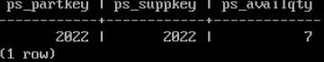

**事务内某条语句执行失败对其余语句的影响**

首先在 partsupp_1 表上加入 PS_AVAILQTY >= 0 的约束

    alter table partsupp_1 add constraint partsupp_chk_1 check(PS_AVAILQTY>=0);

然后插入数据，并更新 PS_AVAILQTY 的值：

    START TRANSACTION;
    select PS_PARTKEY,PS_SUPPKEY,PS_AVAILQTY
    from partsupp_1
    where PS_AVAILQTY<10;

    INSERT INTO partsupp_1
    values(999999,999999,7,0,'comment');

    update partsupp_1
    set PS_AVAILQTY=PS_AVAILQTY-8
    where PS_AVAILQTY<10;
    COMMIT;

查询在上面事务中插入的数据：

    select PS_PARTKEY,PS_SUPPKEY,PS_AVAILQTY
    from partsupp_1
    where PS_PARTKEY='999999' and PS_SUPPKEY='999999' ;

发现不只是更新语句回滚，插入语句也跟着回滚，回滚到整个事务开始前。

事务内某条语句的错误执行会导致该事务在提交时强制回滚，回滚到事务开始前，从而使事务内其他语句的执
行无效。

#### 并发事务控制

**read committed 隔离级别下的脏读**

打开两个 putty 窗口，并连接相同的数据库。

在第一个窗口创建 read committed 隔离级别下的事务 T1，并将 PS_PARTKEY 为“2022”、PS_SUPPKEY 为“1526”的 PS_AVAILQTY 修改为 6：

    START TRANSACTION ISOLATION LEVEL read committed;
    update partsupp_1
    set PS_AVAILQTY=6
    where PS_PARTKEY='2022' and PS_SUPPKEY='1526';

在第二个窗口创建 read committed 隔离级别下的事务 T2。查询 PS_PARTKEY 为“2022”、PS_SUPPKEY 为“1526”的 PS_AVAILQTY 值；

    START TRANSACTION ISOLATION LEVEL read committed;
    select PS_PARTKEY, PS_SUPPKEY, PS_AVAILQTY
    from partsupp_1
    where PS_PARTKEY='2022' and PS_SUPPKEY='1526';

与之前查询的结果相同，都为 1。还未提交的事务 T1 对 PS_AVAILQTY 的更改并没有影响之后事务 T2 的查询结果，这样若事务 T1 之后回滚，事务 T2 也不会读到脏数据。

**read committed 隔离级别下的不可重复读**

然后将事务 T2 提交，并将事务 T1 回滚。再在事务 T1 中，查询 PS_PARTKEY 为“2022”、PS_SUPPKEY 为“1526”的 PS_AVAILQTY 值。

在事务 T2 中，将 PS_PARTKEY 为“2022”、PS_SUPPKEY 为“1526”的 PS_AVAILQTY 修改为 6，并 COMMIT，提交事务 T2。

在事务 T1 中，再次查询 PS_PARTKEY 为“2022”、PS_SUPPKEY 为“1526”的 PS_AVAILQTY 值，并 COMMIT，提交事务 T1。

两次查询的值不一样，第二次查询的值为 6，与之前提交的事务 T2 中更改的值相同。

受到其它已经提交的事务的影响，不同的时刻读到的同一批数据不一样。该例中，T1 事务的查询操作受到之前已经提交的 T2 事务的数据更改操作的影响，使得两次对同一个数据的查询结果不一样。read committed 隔离级别下可能出现不可重复读。

**read committed 隔离级别下的幻读**

这次首先在事务 T1 中，查询 PS_PARTKEY 为“2022”、PS_SUPPKEY 在“23”和“2022”之间的元组：

    select *
    from partsupp_1
    where PS_PARTKEY='2022' and PS_SUPPKEY between '23' and '2022';

在事务 T2 中，插入 PS_PARTKEY 为“2022”、PS_SUPPKEY”为“2022”的元组，并 COMMIT 提交事务
T2：

    INSERT INTO partsupp_1
    values('2022','2022',0,0,'comment');
    commit;

在事务 T1 中，再次查询 PS_PARTKEY 为“2022”、PS_SUPPKEY 在“23”和“2022”之间的元组,并 COMMIT
提交事务。

查询结果一共有 5 行，多出的一行数据为在已经提交的事务 T2 中插入的新元组。

在事务 T1 第一次查询以后，事务 T1 还未提交，事务 T2 就插入了一条在事务 T1 的查询范围内的元组，并且事务 T2 提交了，之后事务 T1 在进行一遍相同的查询，受事务 T2 的插入操作的影响，查询结果多出了一个数据。read committed 隔离级别下可能出现幻读。

**repeatable read 隔离级别下的脏读**

在第一个窗口创建 repeatable read 隔离级别下的事务 T1。并将 PS_PARTKEY 为“2022”、PS_SUPPKEY 为“1526”的 PS_AVAILQTY 修改为 6：

    START TRANSACTION ISOLATION LEVEL repeatable read;
    update partsupp_1
    set PS_AVAILQTY=6
    where PS_PARTKEY='2022' and PS_SUPPKEY='1526';

在第二个窗口创建 repeatable read 隔离级别下的事务 T2。查询 PS_PARTKEY 为“2022”、PS_SUPPKEY 为“1526”的 PS_AVAILQTY 值；

    START TRANSACTION ISOLATION LEVEL repeatable read;
    select PS_PARTKEY, PS_SUPPKEY, PS_AVAILQTY
    from partsupp_1
    where PS_PARTKEY='2022' and PS_SUPPKEY='1526';

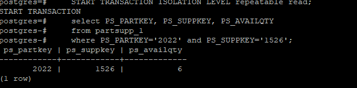

与之前查询的结果相同，都为 1。还未提交的事务 T1 对 PS_AVAILQTY 的更改并没有影响之后事务 T2 的查询
结果，这样若事务 T1 之后回滚，事务 T2 也不会读到脏数据。

**repeatable read 隔离级别下的不可重复读**

然后将事务 T2 提交，并将事务 T1 回滚。再在事务 T1 中，查询 PS_PARTKEY 为“2022”、PS_SUPPKEY 为“1526”的 PS_AVAILQTY 值。

在事务 T2 中，将 PS_PARTKEY 为“2022”、PS_SUPPKEY 为“1526”的 PS_AVAILQTY 修改为 6，并 COMMIT，提交事务 T2。

在事务 T1 中，再次查询 PS_PARTKEY 为“2022”、PS_SUPPKEY 为“1526”的 PS_AVAILQTY 值，并 COMMIT，提交事务 T1。

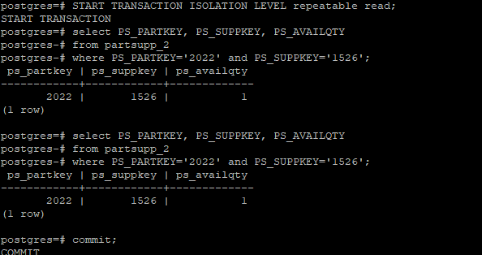

两次查询的值相同，都为 1，前面已经提交的事务 T2 对 PS_AVAILQTY 值的修改未影响事务 T1 的查询。

repeatable read 隔离级别下，一个事务仅仅看到本事务开始之前提交的数据，它不能看到未提交的数据，以及在事务执行期间由其它并发事务提交的修改。该例中，T1 事务只能看到在该事务开始之前提交的数据，而T2 事务是在 T1 事务执行期间提交的，则 T1 事务无法看到 T2 事务修改的数据，T1 事务的查询结果不会产生
变化。repeatable read 隔离级别下不会出现不可重复读。

**repeatable read 隔离级别下的幻读**

这次首先在事务 T1 中，查询 PS_PARTKEY 为“2022”、PS_SUPPKEY 在“23”和“2022”之间的元组：

    select *
    from partsupp_1
    where PS_PARTKEY='2022' and PS_SUPPKEY between '23' and '2022';

在事务 T2 中，插入 PS_PARTKEY 为“2022”、PS_SUPPKEY”为“2022”的元组，并 COMMIT 提交事务
T2：

    INSERT INTO partsupp_1
    values('2022','2022',0,0,'comment');
    commit;

在事务 T1 中，再次查询 PS_PARTKEY 为“2022”、PS_SUPPKEY 在“23”和“2022”之间的元组,并 COMMIT
提交事务。

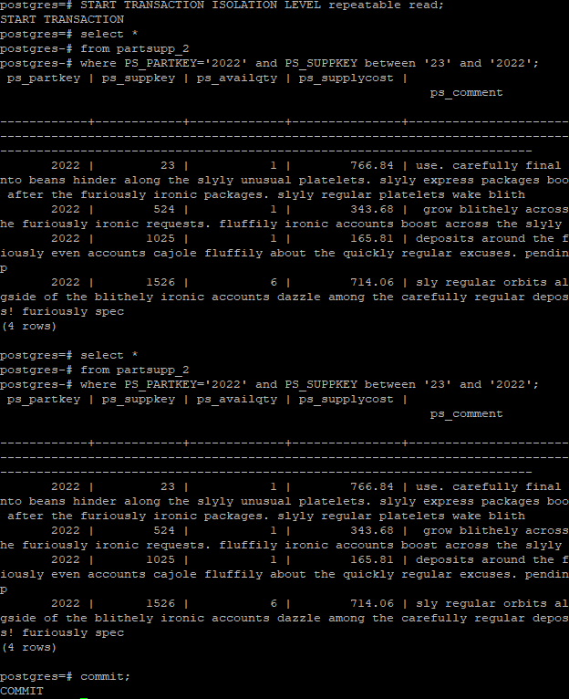

查询结果一共有 4 行，与之前的查询结果相同。

该例中，T1 事务只能看到在该事务开始之前提交的数据，而 T2 事务是在 T1 事务执行期间提交的，则 T1 事务无法看到 T2 事务插入的数据，T1 事务的查询结果不会产生变化。repeatable read 隔离级别下不会出现幻读。

#### 事务锁机制

**隔离级别 read-repeatable 下死锁**

在第一个创窗口中开启事务，执行 select for update 语句，该语句对表中符合条件的元组/数据行加上互斥锁。

在第二个窗口中开启一个事务，也是执行上述 select for update 语句。此时检测到符合筛选条件的部分数据行上加了互斥锁（两次查询的数据行有重叠，存在 PS_PARTKEY=2022 且 PS_SUPPKEY=1526 的数据行），查询进入申请锁的等待阶段。

若在等待一段时间后，仍没有释放互斥锁，达到了设定的锁等待时间，系统会自动判定发生死锁，回滚当前事务并报错：

    ERROR:  Lock wait timeout: thread 140496907597568 on node dn_6001 waiting for ShareLock on transaction 45892 after 120018.947 ms
    DETAIL:  blocked by hold lock thread 140496994690816, statement <select PS_PARTKEY from partsupp_1 where PS_SUPPKEY=1526 for update;>, hold lockmode ExclusiveLock.

**加的互斥锁的粒度**

还是在第一个创窗口中开启事务，执行 select for update 语句，该语句对表中符合条件的元组/数据行加上互斥锁。

在第二个窗口中开启一个事务，执行如下 select for update 语句。

    START TRANSACTION ISOLATION LEVEL repeatable read;
    select PS_SUPPKEY from partsupp_1 where PS_PARTKEY=2022 for update;

正常查询，没有发生锁等待，说明 select for update 语句，不是对整表加互斥锁。

在第二个窗口中，继续执行如下 select for update 语句：

    select PS_PARTKEY from partsupp_1 where PS_SUPPKEY=22 for update;

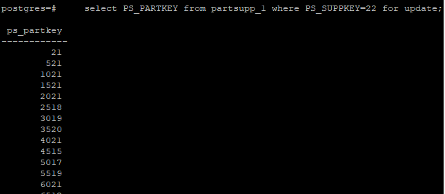

正常查询，没有发生锁等待，说明 select for update 语句，不是对查询条件所在的列加互斥锁。

在第二个窗口中，这次与第一个创窗口的查询条件一样，执行如下 select for update 语句：

    select PS_PARTKEY from partsupp_1 where PS_SUPPKEY=20 for update;

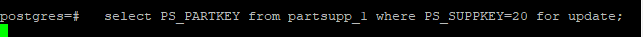

发生锁等待，等待一段时间后，系统会自动判定发生死锁，回滚当前事务并报错：

    ERROR:  Lock wait timeout: thread 140496907597568 on node dn_6001 waiting for ShareLock on transaction 45894 after 120007.602 ms
    DETAIL:  blocked by hold lock thread 140496994690816, statement <select PS_PARTKEY from partsupp_1 where PS_SUPPKEY=20 for update;>, hold lockmode ExclusiveLock.

以上行为说明，select for update 语句，加入的互斥锁的粒度一般为行锁。

**锁管理参数**

|参数|说明|参数类型|取值范围|默认值|
|---|---|---|---|---|
|deadlock_timeout|设置死锁超时检测时间，以毫秒为单位。当申请的锁超过设定值时，系统会检查是否产生了死锁。死锁的检查代价是比较高的，服务器不会在每次等待锁的时候都运行这个过程。在系统运行过程中死锁是不经常出现的，因此在检查死锁前只需等待一个相对较短的时间。增加这个值就减少了无用的死锁检查浪费的时间，但是会减慢真正的死锁错误报告的速度。在一个负载过重的服务器上，用户可能需要增大它。这个值的设置应该超过事务持续时间，这样就可以减少在锁释放之前就开始死锁检查的问题。如果要通过设置 log_lock_waits 来将查询执行过程中的锁等待耗时信息写入日志，请确保 log_lock_waits 的设置值小于 deadlock_timeout 的设置值（或默认值）。|SUSET 类型|整型，1\~2147483647，单位为毫秒（ms）|1s|
|lockwait_timeout|控制单个锁的最长等待时间。当申请的锁等待时间超过设定值时，系统会报错。|SUSET 类型|整型，0 \~ INT_MAX，单位为毫秒（ms）。|20min|
|update_lockwait_timeout|允许并发更新参数开启情况下，该参数控制并发更新同一行时单个锁的最长等待时间。当申请的锁等待时间超过设定值时，系统会报错。|SUSET 类型|整型，0 \~ INT_MAX，单位为毫秒（ms）。|2min|
|max_locks_per_transaction|控制每个事务能够得到的平均的对象锁的数量。共享的锁表的大小是以假设任意时刻最多只有max_locks_per_transaction*(max_connections+max_prepared_transactions) 个独立的对象需要被锁住为基础进行计算的。不超过设定数量的多个对象可以在任一时刻同时被锁定。当在一个事务里面修改很多不同的表时，可能需要提高这个默认数值。只能在数据库启动的时候设置。增大这个参数可能导致 openGauss 请求更多的 System V 共享内存，有可能超过操作系统的缺省配置。当运行备机时，请将此参数设置不小于主机上的值，否则，在备机上查询操作不会被允许。|POSTMASTER 类型|整型，10 \~ INT_MAX|256|
|max_pred_locks_per_transaction|控制每个事务允许断定锁的最大数量，是一个平均值。共享的断定锁表的大小是以假设任意时刻最多只有max_pred_locks_per_transaction*(max_connections+max_prepared_transactions) 个独立的对象需要被锁住为基础进行计算的。不超过设定数量的多个对象可以在任一时刻同时被锁定。当在一个事务里面修改很多不同的表时，可能需要提高这个默认数值。只能在服务器启动的时候设置。增大这个参数可能导致 openGauss 请求更多的 System V 共享内存，有可能超过操作系统的缺省配置。|POSTMASTER 类型|整型，10 \~ INT_MAX|64|
|gs_clean_timeout|控制 DBnode 周期性调用 gs_clean 工具的时间，是一个平均值。openGauss 数据库中事务处理使用的是两阶段提交的方法，当有两阶段事务残留时，该事务通常会拿着表级锁，导致其它连接无法加锁，此时需要调用gs_clean工具对openGauss中两阶段事务进行清理，gs_clean_timeout是控制 DBnode 周期性调用 gs_clean 的时间。增大这个参数可能导致 openGauss 周期性调用 gs_clean 工具的时间延长，导致两阶段事务清理时间延长。|SIGHUP 类型|整型，0 \~ INT_MAX / 1000，单位为秒（s）。|5min|
|partition_lock_upgrade_timeout|在执行某些查询语句的过程中，会需要将分区表上的锁级别由允许读的 ExclusiveLock 级别升级到读写阻塞的 AccessExclusiveLock 级别。如果此时已经存在并发的读事务，那么该锁升级操作将阻塞等待。partition_lock_upgrade_timeout 为尝试锁升级的等待超时时间。在分区表上进行 MERGE PARTITION 和 CLUSTER PARTITION 操作时，都利用了临时表进行数据重排和文件交换，为了最大程度提高分区上的操作并发度，在数据重排阶段给相关分区加锁 ExclusiveLock，在文件交换阶段加锁 AccessExclusiveLock。常规加锁方式是等待加锁，直到加锁成功，或者等待时间超过 lockwait_timeout 发生超时失败。在分区表上进行 MERGE PARTITION 或 CLUSTER PARTITION 操作时，进入文件交换阶段需要申请加锁AccessExclusiveLock，加锁方式是尝试性加锁，加锁成功了则立即返回，不成功则等待 50ms 后继续下次尝试，加锁超时时间使用会话级设置参数partition_lock_upgrade_timeout。特殊值：若 partition_lock_upgrade_timeout 取值-1，表示无限等待，即不停的尝试锁升级，直到加锁成功|USERSET 类型|整型，最小值-1，最大值 3000，单位为秒（s）。|1800|
|fault_mon_timeout|轻量级死锁检测周期。|SIGHUP 类型|整型，最小值 0，最大值 1440，单位为分钟（min）|5min|
|enable_online_ddl_waitlock|控制 DDL 是否会阻塞等待 pg_advisory_lock/pgxc_lock_for_backup 等openGauss 锁。主要用于 OM 在线操作场景，不建议用户设置。|SIGHUP 类型|布尔型，on 表示开启，off 表示关闭。|off|
|xloginsert_locks|控制用于并发写预写式日志锁的个数。主要用于提高写预写式日志的效率。|POSTMASTER 类型|整型，最小值 1，最大值 1000|8|

#### 备份与恢复

创建 customer_t1 表：

    CREATE TABLE customer_t1 
    ( 
    c_customer_sk integer, 
    c_customer_id char(5), 
    c_first_name char(6), 
    c_last_name char(8) 
    );

并向表中插入数据：

    INSERT INTO customer_t1 (c_customer_sk, c_customer_id, c_first_name) VALUES
    (3769, 'hello', DEFAULT) ,
    (6885, 'maps', 'Joes'), 
    (4321, 'tpcds', 'Lily'), 
    (9527, 'world', 'James');

和表customer_t1 一样创建 customer_t2 表，并向表中插入数据：

    INSERT INTO customer_t2 (c_customer_sk, c_customer_id, c_first_name) VALUES
    (3769, 'hello', DEFAULT) ,
    (6885, 'maps', 'Joes'), 
    (9527, 'world', 'James');

创建用户 lucy，并切换到 Lucy 用户：

    CREATE USER lucy WITH PASSWORD "Bigdata@123";
    \c - lucy

创建 lucy shema 的表：

    CREATE TABLE mytable (firstcol int);

向表中插入数据：

    INSERT INTO mytable values (100);

以上准备工作完成后，退出数据库。

**物理备份**

创建存储备份文件的文件夹：

    mkdir -p /home/omm/physical/backup

将数据库进行物理备份；

    gs_basebackup -D /home/omm/physical/backup -p 26000

切换到存储备份文件夹查看备份文件。

**物理备份恢复**

停止 openGauss:

    gs_om -t stop

清理原库中的所有或部分文件;

    cd /gaussdb/data/db1
    rm -rf *

删除文件后，文件目录下文件全部被删除。

使用数据库系统用户权限从备份中还原需要的数据库文件：

    cp -r /home/omm/physical/backup/. /gaussdb/data/db1

恢复后文件列表如下：

重启数据库服务器，并检查数据库内容，发现数据库已经恢复到所需的状态。

### 9.5 实验总结

通过本次试验，我学会使用事务的 commit 和 rollback 操作并了解了commit 和 rollback会导致的结果。我同时还了解了并发访问可能会出现的三种问题，分别是脏读、不可重复读，幻读并学会使用锁来避免这些问题。最后，我还学会了如何备份数据库文件，确保数据库受损时可以恢复到之前的状态。

按照实验指导书的流程完成实验，并没有遇到什么问题。