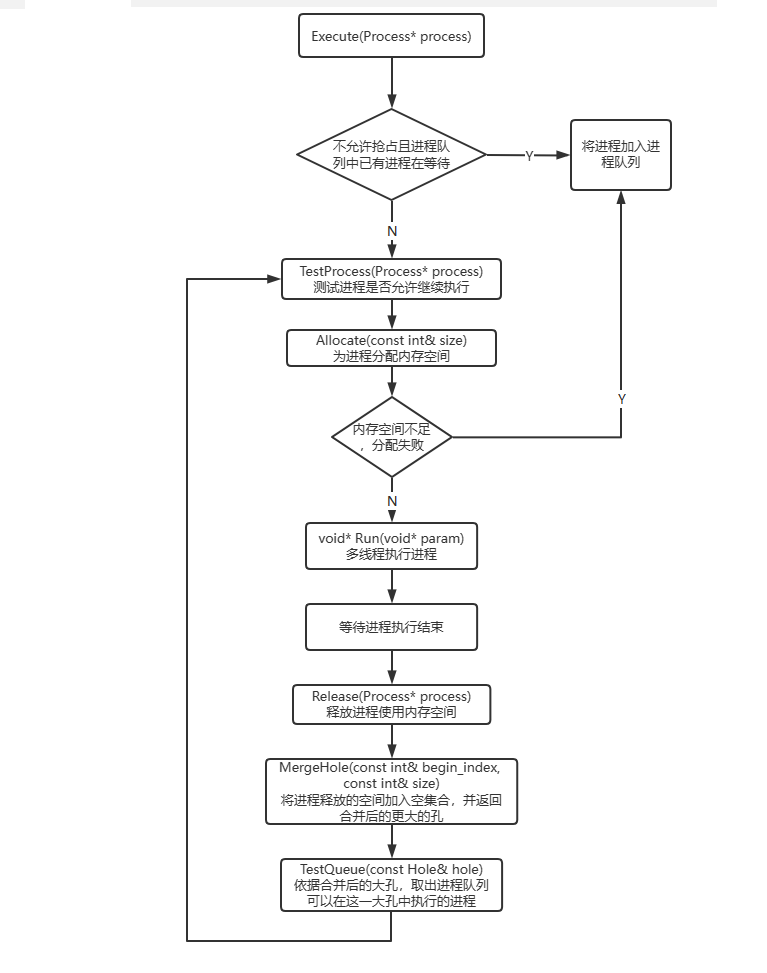
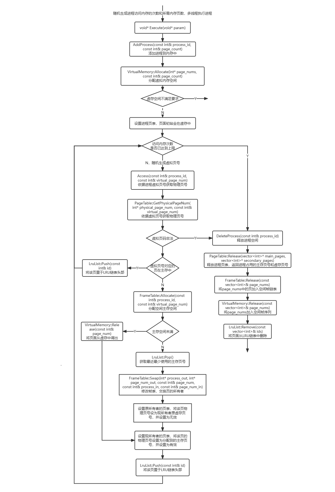

# 内存管理系统实验

## 实验内容

请编写模拟程序演示多任务下内存分配，包括：基本内存分配，虚拟内存分配。

基本内存分配包括连续内存分配和分页内存分配，需要实现内存的初始化，空闲内存管理，内存分配，内存回收等机制。

虚拟内存分配需要实现动态地为进程分配物理帧，完成相应页表映射，实现请求调页和页面置换算法。

## 实验环境

* Windows11
* Visual Studio 2022

## 程序设计

本人一共为本次实验实现了两个模拟程序，第一个为连续内存分配模拟，第二个为分页式内存加上虚拟内存模拟，接下来分别对两个程序进行介绍。

### 连续内存分配模拟

#### 设计思路

程序随机生成一定数量的进程，对于每个进程随机生成其执行时间和花费内存空间大小，多线程的将其交给内存管理系统执行。内存管理系统分别实现了首次适配、最优适配、最差适配算法以及各算法的抢占与非抢占版本。内存分配系统收到进程后，为其分配内存，并等待程序的运行时间结束将其释放；若无法分配需求的大小空间，将进程加入进程队列，等待其他进程运行结束释放内存后再分配个给进程队列中的进程。采用`pthread`库实现多线程运行。

#### 数据结构

连续内存一共有两个重要的数据结构，分别是孔大小队列以及进程队列。

孔大小由一个结构体`Hole`表示，结构中包含孔的起始地址和大小用于表示内存中的一段空间，同时重载了`<`运算符将孔大小作为比较标准，以下为`Hole`具体实现：

    struct Hole
	{
		bool operator<(const Hole& hole) const { return size < hole.size; }

		int begin_index;
		int size;
	};

孔大小队列使用三个继承自抽象类`HoleList`的类实现，分别为`FirstFitHoleList`，`BestFitHoleList`，`WorstFitHoleList`，分别实现首次适配，最优适配和最差适配。以下为`HoleList`具体实现：

    class HoleList
	{
	public:
		virtual void AddHole(const Hole& hole) = 0;

		virtual const int Allocate(const int& size) = 0;

		virtual const Hole MergeHole(const int& begin_index, const int& size) = 0;

		virtual const string ToString() = 0;
	};

* `virtual void AddHole(const Hole& hole)` 向孔序列中添加孔
* `virtual const int Allocate(const int& size)` 分配大小为`size`的空间，返回该空间的起始地址
* `virtual const Hole MergeHole(const int& begin_index, const int& size)` 向孔序列中添加起始地址为`begin_index`，大小为`size`的空间，孔序列会将该空间相邻的孔合并成一个更大的孔
* `virtual const string ToString()` 输出孔队列状态，用于程序调试

子类`FirstFitHoleList`采用无序可变数组`vector<Hole> holes_`存储孔序列；子类`BestFitHoleList`和`WorstFitHoleList`采用有序集合`multiset<Hole> holes_`存储孔序列。

进程队列由简单的可变数组`vector<Process*> process_queue_`表示。

#### 详细实现

首先程序随机生成成一定数量的进程，对于每个进程随机生成其执行时间和花费内存空间大小，并多线程的将其交给内存执行。

以下为进程交给连续内存执行的流程图：

函数`Allocate`将依据适配策略而有所不同。首次适配将在无序可变数组中从头按顺序查找第一个满足要求的孔；最优适配将在有序集合中找到第一个大于需求大小的孔；最差适配将判断最大的孔是否满足要求。

函数`TestQueue`将依据是否允许抢占而有所不同。允许抢占的情况下，将会判断整个进程队列，并将可以在合并后大孔空间内运行的进程集合取出；不允许抢占的情况下，只会判断进程队列的前缀部分，从队首开始判断，直到大孔空间不在满足更多地进程。

#### 输入输出

首先编译程序获得可执行程序`contiguous_memory.exe`

程序的输入如下：

    contiguous_memory MEMORY_SIZE PROCESS_COUNT MAX_TIME MAX_MEMORY -ff|-bf|-wf -p|-fp

* `MEMORY_SIZE`为内存空间大小，单位字节
* `PROCESS_COUNT`为同时允许在内存中的进程数量
* `MAX_TIME` 进程最大执行时间
* `MAX_MEMORY`进程最大花费空间
* `-ff|-bf|-wf`分别表示首次适配，最优适配，最差适配
* `-p|-fp`分别表示允许抢占和不允许抢占

程序输出同时输出到标准输出和文件`output.txt`，输出分为三列

第一列为进程随机创建信息，格式如下：

    Create PROCESS_ID SIZE TIME

其中`PROCESS_ID`为进程唯一标识，`SIZE`为所需空间，`TIME`为执行时间

第二列为进程分配和释放空间的运行信息，格式如下

    Allocate PROCESS_ID (BEGIN_INDEX, END_INDEX) TIME
    Reclaim PROCESS_ID (BEGIN_INDEX, END_INDEX)

其中`PROCESS_ID`为进程唯一标识，`BEGIN_INDEX`和`END_INDEX`分别为分配空间的起始和结束地址，`TIME`为执行时间

第三列为内存调试信息，格式如下

    --------------------------------------------------------
    (BEGIN_INDEX1, END_INDEX1) (BEGIN_INDEX2, END_INDEX2) ...
    --------------------------------------------------------
    -> PROCESS_ID1 -> PROCESS_ID2 -> ...

其中`(BEGIN_INDEX, END_INDEX)`表示孔序列中孔起始位置和结束位置，`-> PROCESS_ID`表示进程队列中还未执行的进程。

以下为程序输出范例：

### 分页内存管理和虚拟内存管理

#### 设计思路

程序随机生成一定数量的进程，对于每个进程随机生成其访问内存的次数和所需内存页数，多线程的将其交给内存管理系统。内存管理系统为每个进程维护一张页表，页表每一项设置有效/无效位，有效表示该页已经存放在主存内，表项指向主存空间的页；无效表示该页存放在虚拟内存空间，表项指向虚拟内存空间的页。内存管理系统采用纯请求调页，初始不为进程分配任何主存空间，将进程存放在虚存内。等到进程需要访问内存时，再将对应页调入主存中；若主存空间已满，将最近最少使用的进程页面换出，并将访问页面换入。采用`pthread`库实现多线程运行。

#### 数据结构

内存管理系统主要有四个重要的数据结构，分别是每个进程的页表，主存的帧表，虚存空闲帧管理结构，LRU列表。

**每个进程的页表**

页表的每一项包含一个无效/有效位和一个物理页码，有效表示该页已经存放在主存内，物理页码指向主存空间的页；无效表示该页存放在虚拟内存空间，物理页码指向虚存空间的页。使用一个结构体`Page`表示页表表项：

	struct Page
	{
		bool is_valid;
		int physical_page_num;
	};

页表使用一个类`PageTable`实现，以下为页表所提供的关键函数成员：

* `const CheckResult GetPhysicalPageNum(int* physical_page_num, const int& virtual_page_num)` 依据虚拟页码`virtual_page_num`获取物理页码`physical_page_num`，返回一个枚举值表示物理页码指向虚存还是主存或虚拟地址非法
* `void Release(vector<int>* main_pages, vector<int>* secondary_pages)` 释放进程，返回进程占用的主存页码`main_pages`和虚存页码`secondary_pages`

使用一个哈希链表`unordered_map<int, PageTable*> processes_`存储这些页表，键为进程的ID。

**主存的帧表**

主存帧表的每一项都包含占用了该帧的进程ID，该进程的虚拟页码，以及下一个空闲帧的序号。帧表采用空闲帧链表方式实现空闲空间管理，每个表项包含下一个空闲帧的序号，若该帧为最后一个空闲帧则设置为-1。表中维护一个变量表示第一个空闲帧的序号，若主存无空闲帧，该序号设置为-1。使用一个结构体`Frame`表示帧表表项：

	struct Frame
	{
		int process_id;
		int virtual_page_num;
		int next_empty;
	};
 
 帧表使用一个类`FrameTable`实现，以下为帧表所提供的关键函数成员：

 * `const int Allocate(const int& process_id, const int& virtual_page_num)` 分配一个空闲帧给进程`process_id`的虚拟页码`virtual_page_num`；返回分配到的物理页码，若主存已满返回-1
 * `void Release(const vector<int>& page_nums)` 将`page_nums`中的页加入空闲帧
 * `void Swap(int* process_out, int* page_num_out, const int& page_num, const int& process_in, const int& page_num_in)` 交换物理页`page_num`的所有者，其中`process_out`和`page_num_out`为换出的进程和其虚拟页码，`process_in`和`page_num_in`为换入的进程和其虚拟页码
  

**虚拟内存空闲帧管理**

在本次实验中，虚拟内存仅需要实现空闲帧管理即可，只需维护一个空闲帧序列`vector<int> empty_pages_`。虚拟内存使用一个类`VirtualMemory`实现，以下为虚拟内存所提供的关键函数成员：

* `const bool Allocate(int* page_nums, const int& page_count)` 获取数量为`page_count`的虚拟内存页码`page_nums`，虚拟内存空间不能满足要求，返回false，否则返回true
* `void Release(const int& page_num)` 将`page_num`加入空闲帧序列
* `void Release(const vector<int>& page_nums)` 将`page_nums`加入空闲帧序列

**LRU链表**

LRU链表为一个带头和尾的双向链表，为了实现快速查询还同时使用一个哈希链表`unordered_map<int, Node> list_`指向双向链表的每一个结点。以下为LRU链表`LruList`所提供的关键函数成员：

* `void Push(const int& id)` 若键为`id`的结点不存在，插入键为`id`的结点到LRU链表表头；否则将键为`id`的结点移至表头
* `const int Pop()` 删除表尾并返回表尾的键
* `void Remove(const vector<int>& ids)` 删除键为`ids`中的所有结点

#### 详细实现

首先程序随机生成一定数量的进程，对于每个进程随机生成其访问内存的次数和所需内存页数，并多线程的将其交给内存管理系统。内存管理系统为其分配好空间后，进程每隔一段时间随机生成虚拟页码访问一次内存。当访问内存的次数全部使用时，释放进程占用的空间。

以下为程序运行流程图：

#### 输入和输出

首先编译程序获得可执行程序`virtual_memory.exe`

程序的输入如下：

    virtual_memory MAIN_MEMORY_SIZE VIRTUAL_MEMORY_SIZE PROCESS_COUNT MAX_COMMAND MAX_PAGE

* `MEMORY_SIZE`为主存空间大小，单位为页
* `VIRTUAL_MEMORY_SIZE`为虚存空间大小，单位为页
* `PROCESS_COUNT`为同时允许在内存中的进程数量
* `MAX_COMMAND` 进程最大访问内存次数
* `MAX_PAGE`进程最大所需页数

程序输出同时输出到标准输出和文件`output.txt`，输出分为两列

第一列为进程和虚拟页号随机创建信息，格式如下：

    Create PROCESS_ID COMMAND_COUNT PAGE_COUNT
	Access PROCESS_ID VIRTUAL_PAGE_NUM
	Normal-exit PROCESS_ID
	Abnormal-exit PROCESS_ID
	Virtual-memory-full PROCESS_ID

* 其中`PROCESS_ID`为进程唯一标识，`COMMAND_COUNT`为进程访问内存次数，`PAGE_COUNT`为进程所需页数，`VIRTUAL_PAGE_NUM`为虚拟页号。

* `Abnormal-exit`表示遇到非法虚拟页号，进程非正常退出；
* `Virtual-memory-full`表示虚拟内存空间不能满足要求，进程退出

第二列为内管理系统处理访问请求的运行信息，格式如下

    Invalid PROCESS_ID VIRTUAL_PAGE_NUM
    Main PROCESS_ID VIRTUAL_PAGE_NUM MAIN_PAGE_NUM
	Secondary PROCESS_ID VIRTUAL_PAGE_NUM MAIN_PAGE_NUM<-SECONDARY_PAGE_NUM
	Secondary PROCESS_ID_1 VIRTUAL_PAGE_NUM_1 MAIN_PAGE_NUM<-(PROCESS_ID_2, VIRTUAL_PAGE_NUM_2)

* 其中`PROCESS_ID`为进程唯一标识，`VIRTUAL_PAGE_NUM`为虚拟页号，`MAIN_PAGE_NUM`为主存页号，`SECONDARY_PAGE_NUM`为虚存页号。
* `Invalid`表示虚拟页号非法；
* `Main`表示页在主存中
* `Secondary`表示页在虚存中，有两种表示形式。`MAIN_PAGE_NUM<-SECONDARY_PAGE_NUM`表示从虚存中调页到主存；`MAIN_PAGE_NUM<-(PROCESS_ID_2, VIRTUAL_PAGE_NUM_2)`表示与另一个进程的页面置换。

以下为程序输出范例：

## 实验总结

本次课程实验中，本人使用`pthread`多线程库，模拟实现了多任务下内存分配。本人一共为本次实验实现了两个模拟程序，第一个为连续内存分配模拟，第二个为分页式内存加上虚拟内存模拟。

个人认为该实验的一大难点在于书本中未提及的一些细节处理以及如何模拟真实运行状况。例如连续内存分配中未执行放在进程队列中的进程该在什么时候执行，最终采用当一个进程结束释放空间并完成孔的合并后，以这个孔的大小作为判断标准，取出可以在这个孔中执行的程序集合执行。例如如何模拟虚存和主存之间的数据传输，最终采用修改页表和帧表的方式来实现，不进行实际传输，因此虚存只需要维护空闲帧集合即可。

第二大难点在于如何更好地划分模块，设计程序架构。好的模块划分能够降低程序出错的概率，出错时也能够很快地定位出错位置。例如如何同时实现连续内存分配中的三种适配策略，最终几经修改，使用继承自同一个抽象类的三个类实现。分页和虚存的程序一开始就花费大量时间思考程序模块划分，最终写完就基本可以正确执行。

第三大难点在于多线程的使用，对于共享数据较多的多线程程序，如何控制共享数据的访问就显得十分重要，也是及其容易出现bug的地方。在写多线程程序时一定要对程序的执行有着很好地理解，知道程序任何时候的走向，才能尽量减少出错。

本次实践虽然仅仅实现了连续内存、分页内存和虚存的基本内容，但也耗费了大量的时间。通过本次实践，本人对于内存分配有了更深的认识，同时程序设计能力也有了一定的提升。

