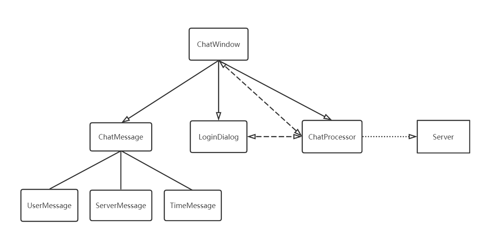

# 语音客服机器人

- [功能描述](#功能描述)
- [总体设计说明](#总体设计说明)
  - [软件开发环境](#软件开发环境)
  - [软件总体结构和模块设计](#软件总体结构和模块设计)
- [接口说明](#接口说明)
  - [模块接口](#模块接口)
  - [配置文件](#配置文件)
  - [用户数据格式](#用户数据格式)
  - [通信协议接口](#通信协议接口)
- [脚本语法说明](#脚本语法说明)

## 功能描述

机器人客服是目前提升客服效率的重要技术，在银行、通信和商务等领域的复杂信息系统中有广泛的应用。语音客服机器人定义了一种领域特定脚本语言，这种语言可以用于描述在线客服机器人的自动应答逻辑。该系统将解释执行脚本，可以依据用户的不同输入，根据脚本的逻辑设计给出相应的应答。

## 总体设计说明

### 软件开发环境

* Windows11
* Visual studio 2022
* QT Creator 4.3.0

### 软件总体结构和模块设计

软件由服务器和客户端组成。服务器主要负责解析脚本语言，多线程处理客户端请求，依据客户端传来的用户输入分析应答，并传回给客户端。客户端提供一个简洁的GUI界面，为客户提供输入接口，处理服务器要求的执行任务，并显示服务器输出。
#### 服务器模块设计

一共分为五大模块，分别为主模块，脚本解释模块，异常模块，日志模块，以及客户端处理模块

具体模块划分如下

    base
    |-- main
    |-- script_interpreter
    |   |-- Step
    |   |-- SyntaxTree
    |   |-- Interpreter
    |-- exception
    |   |-- ScriptException
    |   |-- SocketException
    |-- Logger
    |-- ClientProcessor

##### 主模块

主模块负责读取配置文件对软件进行初始化，并多线程接受客户端请求，将请求交由客户端处理模块处理。

为了防止线程的无限创建，主模块中设计客户端处理对象池和描述客户端处理对象数量的信号量，当接受了上限数量的客户端请求后陷入等待状态，直到某个线程服务结束并释放。
##### 脚本解释模块设计

脚本解释模块主要包含两个小模块，分别为脚本解析模块`SyntaxTree`和解释执行模块`Interpreter`。

脚本解析模块接受一个脚本文本，对脚本文本进行词法分析和语法分析后生成一个个`Step`并合成语法分析树交给解释执行模块。

解释执行模块依据脚本解析模块生成的语法分析树，接受来自客户端处理模块的用户输入，对用户输入进行分析后，输出应答文本和其他执行任务交给客户端处理模块。

##### 异常模块设计

异常模块主要包含自定义的脚本分析过程中产生的异常`ScriptException`和与客户端通信过程中产生的异常`SocketException`用于异常处理。

##### 日志模块设计

日志模块用于输出程序执行过程中产生的各类型信息。日志将同时输出到标准输出和文件中。

日志文件名为当前日期，日志文件的更新间隔和最大数量可在配置文件中更改。为了避免日志文件占用过大空间，日志文件数量达到最大数量后将会删除最早日志文件。

##### 客户端处理模块设计

客户端处理模块定义了和客户端通信的消息格式，处理和客户端通信的各种逻辑。

客户端处理模块提供各类分装后的输入输出回调函数给解释执行模块，方便解释执行模块不考虑内部逻辑的调用输入输出。

#### 客户端模块设计

一共分为三个模块，分别为窗口模块，文本显示模块，网络通信模块

    base
    |-- window
    |   |-- ChatWindow
    |   |-- LoginDialog
    |-- chat_message
    |   |-- ChatMessage
    |   |-- UserMessage
    |   |-- ServerMessage
    |   |-- TimeMessage 
    |-- ChatProcessor

##### 窗口模块

窗口模块负责显示服务器输出和获取用户输入。

包括一个登录会话窗口`LoginDialog`和一个聊天窗口`ChatWindow`，登录会话窗口负责获取用户ID，聊天窗口显示服务器和用户的聊天记录。

##### 文本显示模块

文本显示模块负责格式化显示用户输入文本`UserMessage`，服务器输出文本`ServerMessage`，时间`TimeMessage`。

主要功能为将文本调整为适当大小，放入窗口部件，用于在窗口内显示。

##### 网络通信模块

网络通信模块负责与服务器进行通信，处理服务器请求，操作窗口完成服务器要求的任务。

## 接口说明

### 模块接口

#### 服务器模块接口

* script_interpreter
    * [Step](doc/server/Step.md)
    * [SyntaxTree](doc/server/SyntaxTree.md)
    * [Interpreter](doc/server/Interpreter.md)
* exception
    * [SocketException](doc/server/SocketException.md)
    * [SocketDisconnectException](doc/server/SocketDisconnectException.md)
    * [SocketErrorException](doc/server/SocketErrorException.md)
    * [ScriptException](doc/server/ScriptException.md)
    * [ScripFiletException](doc/server/ScriptFileException.md)
    * [ScriptParseException](doc/server/ScriptParseException.md)
    * [ScriptVariableNotExistException](doc/server/ScriptVariableNotExistException.md)
* [Logger](doc/server/Logger.md)
* [ClientProcessor](doc/server/ClientProcessor.md)

#### 客户端模块接口

* window
    * [ChatWindow](doc/client/ChatWindow.md)
    * [LoginDialog](doc/client/LoginDialog.md)
* chat_message
    * [ChatMessage](doc/client/ChatMessage.md)
    * [UserMessage](doc/client/UserMessage.md)
    * [ServerMessage](doc/client/ServerMessage.md)
    * [TimeMessage](doc/client/TimeMessage.md)
* [ChatProcessor](doc/client/ChatProcessor.md)

### 配置文件

配置项以json格式存储，以下为具体配置项：

|键|值类型|描述|
|---|---|---|
|"server_ip"|string|服务器IP地址|
|"server_port"|integer|服务器端口号|
|"max_connections"|integer|最大连接数|
|"max_buf_size"|integer|消息队列的最大长度|
|"log_dictionary_path"|string|日志文件存储目录地址|
|"max_generate_interval"|integer|新建日志文件周期|
|"max_log_amount"|integer|日志文件最大数量|
|"script_file_path"|string|脚本文件地址|
|"userdata_file_path"|string|用户数据文件地址|

### 用户数据格式

用户数据以json格式存储，存储格式如下：

    {
        "用户id1": {
            "变量名": 变量值,
            ...
        },
        "用户id2": {
            "变量名": 变量值,
            ...
        },
        ...
    }

数据项范例：

    "000": {
        "name": "000",
        "amount": 0
    }

### 通信协议接口

服务器和客户端间基于TCP进行通信，
以下为通信过程中四种数据格式：

#### 获取用户ID

|数据格式|方向|
|---|---|
|\| ID(1~Max Id Length) \||client -> server |
|\| TRUE/FALSE(1) \||server -> client|

客户端获取用户id后发送给服务器；服务器收到用户id后获取用户id对应的变量表，若用户存在返回TRUE给客户端，否则返回FALSE给客户端

#### 执行SPEAK指令

|数据格式|方向|
|---|---|
|\| SPEAK(1) \| Text(0~(Max Text Size) \||server -> client|
|\| ACK(1) \||client -> server |

服务器发送SPEAK指令以及需要输出的文本给客户端；客户端收到服务器文本后显示在窗口中，并发送ACK给服务器

#### 执行LISTEN指令

|数据格式|方向|
|---|---|
|\| LISTEN(1) \| Begin Timer(4) \| End Timer(4) \||server -> client|
|\| Is Empty(1) \| Text(0~(Max Input Size) \||client -> server |

服务器发送LISTEN指令以及允许输入的时间限制给客户端；客户端在时间限制内获取用户输入，并将用户输入发送给服务器，若用户无输入Is Empty为1，否则Is Empty为0

#### 执行EXIT指令

|数据格式|方向|
|---|---|
|\| Exit(1) \||server -> client|

服务器发送EXIT指令给客户端；客户端收到后结束与服务器通信

## 脚本语法说明

详见[脚本语法说明](doc/脚本语法说明.md)

